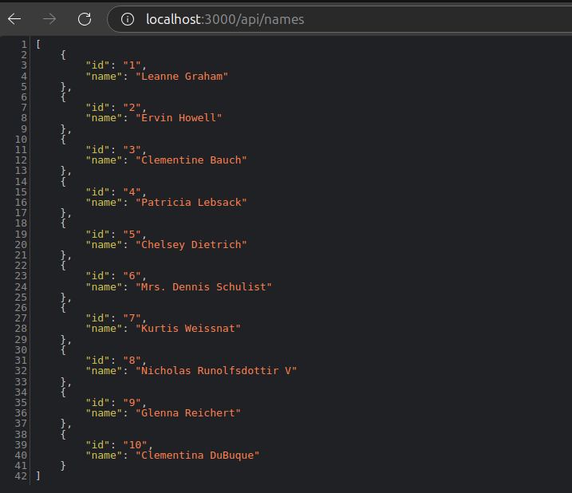

# **Actividad 11 - Refactorización y Mejoras de Aplicación Next.js**

En esta **actividad 11**, se realizaron diversas mejoras sobre una aplicación refactorizada en **Next.js**, que originalmente estaba basada en **Express.js** y **React**. Los objetivos principales incluyen la migración de rutas API, la creación de interfaces personalizadas, el uso de **CSS modular**, la persistencia de datos usando `localStorage`, la implementación de **SEO dinámico**, y la utilización de **ISR** (Incremental Static Regeneration). A continuación, explicaré cada uno de los ejercicios realizados, comparando la versión inicial con la mejorada, detallando cada cambio, con ejemplos comentados y una estructura clara del proyecto.

---

## **Tabla de Contenidos**

1. [Introducción](#actividad-11---refactorización-y-mejoras-de-aplicación-next-js)
2. [Ejercicios Realizados](#ejercicios-realizados)
   - [Ejercicio 1: Manejo de Errores en Rutas API](#ejercicio-1-manejo-de-errores-en-rutas-api)
   - [Ejercicio 2: Integración de CSS Modular](#ejercicio-2-integración-de-css-modular)
   - [Ejercicio 3: Extender Funcionalidad del Contador](#ejercicio-3-extender-funcionalidad-del-contador)
   - [Ejercicio 4: Parámetros Opcionales en la API](#ejercicio-4-parámetros-opcionales-en-la-api)
   - [Ejercicio 5: SEO con `next/head`](#ejercicio-5-seo-con-nexthead)
   - [Ejercicio 6: Pre-renderización Incremental (ISR)](#ejercicio-6-pre-renderización-incremental-isr)
3. [Rutas Probadas y Resultados](#rutas-probadas-y-resultados)
4. [Estructura del Proyecto](#estructura-del-proyecto)
5. [Comandos de Creación y Ejecución del Proyecto](#comandos-de-creación-y-ejecución-del-proyecto)
6. [Conclusión](#conclusión)

---

## **Ejercicios Realizados**

### **Ejercicio 1: Manejo de Errores en Rutas API**

#### **Versión Inicial - `names.ts`**

La versión inicial de `names.ts` tenía un manejo de errores muy limitado. Solo devolvía un error genérico `500` si la solicitud fallaba.

```typescript
import type { NextApiRequest, NextApiResponse } from "next";

type responseItemType = {
    id: string;
    name: string;
};

export default async function handler(
    req: NextApiRequest,
    res: NextApiResponse
): Promise<NextApiResponse<responseItemType[]> | void> {
    const url = "https://www.usemodernfullstack.dev/api/v1/users";
    let data;

    try {
        const response = await fetch(url);
        data = (await response.json()) as responseItemType[];
    } catch (err) {
        return res.status(500);
    }

    const names = data.map((item) => {
        return { id: item.id, name: item.name };
    });

    return res.status(200).json(names);
}
```

#### **Cambios Realizados**

1. **Mejor Manejo de Errores**: Añadí un manejo de errores detallado para devolver códigos específicos como `404` y `500`. Esto facilita el diagnóstico por parte del usuario o desarrollador cuando algo falla.
2. **Detalles del Error**: Incluí mensajes detallados que ayudan a identificar el motivo específico del error.

#### **Versión Mejorada y Comentada - `names.ts`**

```typescript
import type { NextApiRequest, NextApiResponse } from "next";
import fetch from 'node-fetch';

// Definimos el tipo para la respuesta de la API.
type ResponseItemType = {
    id: string; // ID del usuario
    name: string; // Nombre del usuario
};

// Manejador de la ruta API que incluye un manejo de errores detallado.
export default async function handler(
    req: NextApiRequest,
    res: NextApiResponse<ResponseItemType[] | { error: string; details?: string }>
) {
    const url = "https://jsonplaceholder.typicode.com/users"; // URL de ejemplo que simula una lista de usuarios
    let data: ResponseItemType[];

    try {
        // Realizamos la solicitud a la API externa.
        const response = await fetch(url);
        
        // Verificamos si la respuesta fue exitosa.
        if (!response.ok) {
            return res.status(404).json({ error: "External API not found", details: response.statusText });
        }

        // Obtenemos los datos de la respuesta JSON.
        data = (await response.json()) as ResponseItemType[];
    } catch (error) {
        // Capturamos cualquier error durante la solicitud y respondemos con un error 500.
        console.error("Error fetching data:", error);
        return res.status(500).json({ error: "Internal Server Error", details: String(error) });
    }

    // Mapeamos los datos para asegurar que el `id` sea un string.
    const names = data.map((item) => ({
        id: item.id.toString(), // Convertimos el `id` a string si no lo es.
        name: item.name,
    }));

    // Respondemos con los datos obtenidos.
    return res.status(200).json(names);
}
```

#### **Pregunta Teórica**

**¿Por qué es importante devolver códigos de estado HTTP adecuados en las API y cómo afectan la experiencia del usuario?**

Los **códigos de estado HTTP** permiten a los consumidores de la API conocer el resultado de la solicitud sin necesidad de profundizar en la lógica de la misma. Si se devuelve un `200`, se indica éxito; un `404` informa que el recurso no fue encontrado; y un `500` indica un error interno. Esto facilita la identificación del problema, mejora la experiencia del usuario final y ayuda a los desarrolladores a diagnosticar y solucionar problemas más rápidamente.

---

### **Ejercicio 2: Integración de CSS Modular**

#### **Versión Inicial - `hello.tsx`**

En la versión inicial, los estilos estaban presentes en un archivo CSS global, lo cual podía causar conflictos en una aplicación grande.

```typescript
import type { NextPage } from "next";
import Head from "next/head";
import Link from "next/link";
import Image from "next/image";

const Hello: NextPage = () => {
    return (
        <div>
            <Head>
                <title>Titulo de pagina Hola Mundo</title>
                <meta property="og:title" content="Hello World" key="title" />
            </Head>
            <div>Hello World!</div>
            <div>
                Usa el ancla de HTML para un <a href="https://nostarch.com">enlace externo</a> y el componente Link para una 
                <Link href="/components/weather">pagina interna</Link>.
                <Image src="/vercel.svg" alt="Vercel Logo" width={72} height={16} />
            </div>
        </div>
    );
};

export default Hello;
```

#### **Cambios Realizados**

1. **CSS Modular**: Implementé **CSS modular** para encapsular estilos, evitando el uso de un archivo CSS global.
2. **Mejor Organización**: Ahora los estilos solo afectan al componente `Hello`, evitando conflictos de clases en la aplicación.

#### **Versión Mejorada y Comentada - `hello.tsx`**

```typescript
import type { NextPage } from "next";
import Head from "next/head";
import Link from "next/link";
import Image from "next/image";
import styles from './Hello.module.css'; // Importamos el CSS modular.

const Hello: NextPage = () => {
    return (
        <div className={styles.helloContainer}>
            <Head>
                <title>Hello Page</title> // Título de la página para el SEO.
                <meta name="description" content="This is the hello page" /> // Meta descripción.
                <meta property="og:title" content="Hello World" key="title" /> // Meta para redes sociales.
            </Head>
            <div>Hello World!</div> // Mensaje principal.
            <div>
                Usa el ancla de HTML para un <a href="https://nostarch.com">enlace externo</a> y el componente Link para una{" "}
                <Link href="/components/weather">pagina interna</Link>.
                <Image src="/vercel.svg" alt="Vercel Logo" width={72} height={16} /> // Imagen de logo de Vercel.
            </div>
        </div>
    );
};

export default Hello;
```

**Archivo `Hello.module.css`**:

```css
.helloContainer {
    text-align: center; /* Alineación centrada */
    font-size: 1.5rem; /* Tamaño del texto */
    color: #333; /* Color del texto */
    padding: 20px; /* Espaciado interno */
    margin: 10px; /* Espaciado externo */
}
```

#### **Pregunta Teórica**

**Explica las ventajas de usar CSS modular en comparación con el uso de un archivo CSS global en una aplicación grande.**

El uso de **CSS modular** permite encapsular los estilos dentro de un componente específico, evitando que los estilos afecten otras partes de la aplicación. Esto mejora la mantenibilidad del proyecto, ya que cada componente tiene su propio archivo de estilos, minimizando los conflictos entre clases y mejorando la claridad del código.

---

### **Ejercicio 3: Extender Funcionalidad del Contador**

#### **Versión Inicial - `WeatherComponent.tsx`**

La versión inicial de `WeatherComponent` incluía un contador que se incrementaba al hacer clic, pero este valor no se mantenía cuando la página era recargada.

```typescript
import React, { useState } from "react";

const WeatherComponent = () => {
    const [count, setCount] = useState(0);

    return (
        <div>
            <h1 onClick={() => setCount(count + 1)}>
                El clima es sunny, y el contador muestra {count}
            </h1>
        </div>
    );
};

export default WeatherComponent;
```

#### **Cambios Realizados**

1. **Persistencia del Estado con `localStorage`**: Implementé el uso de `localStorage` para mantener el valor del contador entre recargas de la página.
2. **`useEffect`**: Utilicé el hook `useEffect` para cargar y guardar el valor del contador desde y hacia `localStorage`.

#### **Versión Mejorada y Comentada - `WeatherComponent.tsx`**

```typescript
import React, { useState, useEffect } from "react";
import styles from "./Weather.module.css"; // Importamos los estilos CSS modular.

// Definimos la interfaz para las propiedades que el componente recibirá.
interface WeatherProps {
    weather: string; // Clima actual (e.g., "sunny").
    temp: number; // Temperatura actual en grados Celsius.
}

const WeatherComponent: React.FC<WeatherProps> = ({ weather, temp }) => {
    // Estado del contador, inicializado con el valor guardado en localStorage si existe.
    const [count, setCount] = useState<number>(() => {
        if (typeof window !== "undefined") {
            const savedCount = localStorage.getItem("count");
            return savedCount ? parseInt(savedCount) : 0;
        }
        return 0;
    });

    // Guarda el valor del contador en localStorage cada vez que cambia.
    useEffect(() => {
        if (typeof window !== "undefined") {
            localStorage.setItem("count", count.toString());
        }
    }, [count]);

    return (
        <div className={styles.weatherContainer}>
            <h1 onClick={() => setCount(count + 1)}>
                El clima es {weather}, la temperatura es {temp}°C, y el contador muestra {count}
            </h1>
        </div>
    );
};

export default WeatherComponent;
```

**Comentarios sobre los cambios:**

- **Persistencia del Estado**: Al utilizar **`localStorage`**, el estado del contador se mantiene incluso cuando el usuario recarga la página o la cierra y vuelve a abrirla.
- **Hook `useEffect`**: Este hook se usa para guardar el valor del contador cada vez que cambia, asegurando que `localStorage` siempre esté sincronizado con el estado.

#### **Pregunta Teórica**

**¿Por qué utilizar `localStorage` para la persistencia del estado en el navegador?**

El uso de **`localStorage`** permite mantener la información a través de recargas y cierres del navegador, mejorando la experiencia del usuario al preservar sus interacciones previas. Esto es particularmente útil para funcionalidades que requieren guardar configuraciones o valores que el usuario necesita ver al regresar a la aplicación.

---

### **Ejercicio 4: Implementar Parámetros Opcionales en la API**

#### **Versión Inicial - `weather/[zipcode].ts`**

La API inicial `weather/[zipcode].ts` no tenía capacidad para manejar parámetros opcionales, lo que limitaba la flexibilidad de las solicitudes.

```typescript
import type { NextApiRequest, NextApiResponse } from "next";

export default async function handler(
    req: NextApiRequest,
    res: NextApiResponse
) {
    const { zipcode } = req.query;

    res.status(200).json({ zipcode, weather: "sunny", temp: 35 });
}
```

#### **Cambios Realizados**

1. **Parámetro Opcional `tempUnit`**: Añadí soporte para un parámetro opcional llamado `tempUnit` que permite al usuario especificar si la temperatura debe mostrarse en Celsius o Fahrenheit.
2. **Conversión de Unidades**: Implementé la lógica para convertir la temperatura a Fahrenheit si `tempUnit` es igual a `"imperial"`.

#### **Versión Mejorada y Comentada - `weather/[zipcode].ts`**

```typescript
import type { NextApiRequest, NextApiResponse } from "next";

// Manejador de la ruta API para obtener el clima.
export default async function handler(
    req: NextApiRequest,
    res: NextApiResponse
) {
    const { zipcode, tempUnit } = req.query; // Obtenemos los parámetros desde la query.

    let temp = 35; // Definimos la temperatura base en grados Celsius.

    // Si el parámetro opcional 'tempUnit' es igual a 'imperial', convertimos la temperatura a Fahrenheit.
    if (tempUnit === "imperial") {
        temp = Math.round((temp * 9 / 5) + 32); // Convertimos Celsius a Fahrenheit.
    }

    // Respondemos con el clima y la temperatura según el código postal y la unidad de temperatura.
    res.status(200).json({ zipcode, weather: "sunny", temp });
}
```

**Comentarios sobre los cambios:**

- **Flexibilidad de la API**: Añadir un **parámetro opcional** mejora la flexibilidad de la API, permitiendo a los usuarios especificar cómo prefieren recibir la información.
- **Conversión de Unidades**: Permitir que los usuarios elijan entre Celsius y Fahrenheit proporciona una mejor experiencia, ya que diferentes usuarios pueden tener preferencias diferentes.

#### **Pregunta Teórica**

**¿Por qué es importante implementar parámetros opcionales en una API y cómo afectan la flexibilidad del servicio?**

Los **parámetros opcionales** permiten que una API sea más flexible y adaptable para diversos casos de uso sin la necesidad de rutas adicionales. Esto facilita el desarrollo y mejora la experiencia del consumidor, permitiendo personalizar la respuesta según las preferencias del usuario sin afectar la estructura principal de la API.

---

### **Ejercicio 5: Agregar SEO con `next/head`**

#### **Versión Inicial - `hello.tsx`**

La versión inicial no incluía ningún tipo de **SEO dinámico**, lo cual es crucial para mejorar la visibilidad de la página en los motores de búsqueda.

```typescript
import type { NextPage } from "next";

const Hello: NextPage = () => {
    return (
        <div>
            <div>Hello World!</div>
        </div>
    );
};

export default Hello;
```

#### **Cambios Realizados**

1. **Implementación de `next/head`**: Añadí el componente **`next/head`** para incluir **metaetiquetas** y mejorar el SEO de la página.
2. **SEO Dinámico**: Configuré el título y la descripción de la página para que sean amigables para los motores de búsqueda.

#### **Versión Mejorada y Comentada - `hello.tsx`**

```typescript
import type { NextPage } from "next";
import Head from "next/head"; // Importamos el componente Head para añadir SEO.

const Hello: NextPage = () => {
    return (
        <>
            <Head>
                <title>Hello Page</title> // Título de la página que aparecerá en la pestaña del navegador.
                <meta name="description" content="This is the hello page" /> // Meta descripción importante para SEO.
                <meta property="og:title" content="Hello World" key="title" /> // Información para redes sociales.
            </Head>
            <div>
                Hello World!
            </div>
        </>
    );
};

export default Hello;
```

**Comentarios sobre los cambios:**

- **Mejora de Visibilidad**: Añadir **`next/head`** con metaetiquetas adecuadas mejora la visibilidad en motores de búsqueda y redes sociales.
- **Título y Meta Descripción**: Estas etiquetas permiten definir la descripción que aparece en los resultados de búsqueda, lo cual es fundamental para atraer usuarios.

#### **Pregunta Teórica**

**¿Qué ventajas ofrece el uso de `next/head` en comparación con la configuración estática de SEO?**

El uso de **`next/head`** permite definir información relevante para SEO de forma **dinámica** y específica para cada página. Esto mejora la visibilidad de la aplicación en motores de búsqueda y redes sociales, incrementando la relevancia del contenido y permitiendo que cada página tenga una configuración personalizada para SEO, en lugar de una única configuración general.

---

### **Ejercicio 6: Implementar Pre-renderización Incremental (ISR)**

#### **Versión Inicial - `weather.tsx`**

La versión inicial mostraba datos estáticos, y no había una manera de actualizar automáticamente estos datos sin reconstruir toda la aplicación.

```typescript
import type { NextPage } from "next";

const WeatherPage: NextPage = () => {
    return (
        <div>
            <h1>El clima es sunny</h1>
        </div>
    );
};

export default WeatherPage;
```

#### **Cambios Realizados**

1. **Implementación de ISR**: Utilicé **`getStaticProps`** junto con `revalidate` para implementar **Incremental Static Regeneration**. Esto permite que la página se regenere automáticamente cada cierto tiempo, manteniendo los datos relativamente actualizados.
2. **Datos Dinámicos**: Los datos se simulan y se regeneran automáticamente cada **30 segundos** sin necesidad de una reconstrucción manual.

#### **Versión Mejorada y Comentada - `weather.tsx`**

```typescript
import type { NextPage } from "next";
import WeatherComponent from "../components/WeatherComponent";

// Utilizamos getStaticProps para obtener datos de forma estática, pero que se puedan regenerar cada cierto tiempo.
export async function getStaticProps() {
    const temp = 35; // Simulación de datos obtenidos de una API.

    return {
        props: { temp }, // Enviamos los datos como propiedades al componente.
        revalidate: 30, // ISR: Cada 30 segundos, Next.js regenerará esta página.
    };
}

// Página que utiliza el componente WeatherComponent, mostrando la información del clima.
const WeatherPage: NextPage<{ temp: number }> = ({ temp }) => {
    return <WeatherComponent weather="sunny" temp={temp} />;
};

export default WeatherPage;
```

**Comentarios sobre los cambios:**

- **Actualización Automática**: Utilizar **ISR** permite mantener la información actualizada sin sacrificar la velocidad y la eficiencia de un sitio estático.
- **Mejora de Rendimiento**: Con **ISR**, se tiene lo mejor de dos mundos: velocidad y datos actualizados sin necesidad de intervenciones manuales.

#### **Pregunta Teórica**

**¿Qué beneficios ofrece la Pre-renderización Incremental en Next.js en comparación con el renderizado estático estándar?**

La **Pre-renderización Incremental (ISR)** permite regenerar páginas estáticas en intervalos definidos sin tener que reconstruir toda la aplicación. Esto mejora el rendimiento y garantiza que la información sea relativamente actualizada, manteniendo la velocidad de un sitio estático mientras se actualizan los datos periódicamente.

---

### **Rutas Probadas y Resultados**

En esta sección se presenta el detalle de las rutas que fueron probadas para validar las funcionalidades implementadas durante la refactorización y mejora de la aplicación **Next.js**.

#### **1. Ruta `/api/names`**

- **Descripción**: Esta ruta devuelve una lista de usuarios obtenida de una API externa. Se implementó un manejo de errores detallado para capturar posibles fallos en la solicitud externa y devolver respuestas adecuadas (`404`, `500`, etc.).
- **Ruta Completa**: [http://localhost:3000/api/names](http://localhost:3000/api/names)
- **Resultado**: La captura muestra una lista de usuarios en formato JSON, confirmando que la solicitud fue exitosa.
  - **Captura**: 

#### **2. Ruta `/api/weather/:zipcode?tempUnit=imperial`**

- **Descripción**: Esta ruta permite obtener la información del clima para un código postal (`zipcode`) y tiene la capacidad de aceptar el parámetro opcional `tempUnit`. Cuando `tempUnit` es igual a `"imperial"`, la temperatura se muestra en Fahrenheit.
- **Ruta Completa**: [http://localhost:3000/api/weather/12345?tempUnit=imperial](http://localhost:3000/api/weather/12345?tempUnit=imperial)
- **Resultado**: La captura muestra la respuesta JSON con el código postal y la temperatura en la unidad especificada, confirmando que el parámetro opcional funciona como se esperaba.
  - **Captura**: 

#### **3. Página `/components/weather`**

- **Descripción**: La página `/components/weather` utiliza el componente `WeatherComponent` que muestra el clima actual y un contador que puede ser incrementado al hacer clic. Se añadió funcionalidad para que el valor del contador se mantenga utilizando `localStorage`, de manera que el valor persista incluso al recargar la página.
- **Ruta Completa**: [http://localhost:3000/components/weather](http://localhost:3000/components/weather)
- **Resultado**: La captura muestra que el contador se incrementa cada vez que se hace clic y que, al recargar la página, el valor del contador no se reinicia, confirmando que `localStorage` funciona como se esperaba.
  - **Captura**: 

#### **4. Página `/hello`**

- **Descripción**: La página `/hello` presenta un mensaje "Hello World!", junto con enlaces internos y externos. Se utilizó el componente `next/head` para añadir metaetiquetas de SEO, lo cual mejora la visibilidad de la página en los motores de búsqueda y redes sociales.
- **Ruta Completa**: [http://localhost:3000/hello](http://localhost:3000/hello)
- **Resultado**: La captura muestra la página cargada con el mensaje "Hello World!" y los enlaces. También se verificó que el título de la página y la descripción meta aparezcan correctamente en la pestaña del navegador.
  - **Captura**: 

---

### **Estructura del Proyecto**

El proyecto está organizado para garantizar una estructura clara, modular y fácil de mantener, como se muestra a continuación:

```
├── Actividad11
│   ├── refactored-app
│       ├── .next                     // Archivos generados durante la construcción del proyecto.
│       ├── node_modules              // Módulos instalados a través de npm.
│       ├── public                    // Recursos públicos (imágenes, íconos, etc.).
│       ├── src
│           ├── pages
│               ├── api
│                   ├── weather
│                       └── [zipcode].ts  // Ruta API para obtener el clima basado en un código postal, admite parámetros opcionales.
│                   ├── hello.ts          // Ruta API de ejemplo para una respuesta de "Hello".
│                   └── names.ts          // Ruta API para obtener la lista de usuarios.
│               ├── hello.tsx             // Página que muestra un saludo "Hello World!" con metaetiquetas de SEO.
│               └── index.tsx             // Página de inicio.
│           ├── components
│               ├── Weather.module.css    // Estilos modulares para el componente WeatherComponent.
│               ├── weather.tsx           // Página que muestra el componente del clima.
│               └── WeatherComponent.tsx  // Componente que muestra el clima y un contador persistente.
│           ├── fonts
│               ├── _app.tsx              // Configuración general de la aplicación.
│               ├── _document.tsx         // Personalización del documento HTML inicial.
│               ├── Hello.module.css      // Estilos CSS modular para el componente hello.
│               └── hello.tsx             // Página "Hello" con enlaces y SEO.
│           ├── styles
│               ├── globals.css           // Estilos globales de la aplicación.
│               └── Home.module.css       // Estilos CSS modular para la página principal.
│       ├── .eslintrc.json                // Archivo de configuración para ESLint.
│       ├── .gitignore                    // Archivos y carpetas que serán ignorados por Git.
│       ├── custom.d.ts                   // Tipos personalizados de TypeScript.
│       ├── next-env.d.ts                 // Tipos para Next.js.
│       ├── next.config.js                // Archivo de configuración para Next.js.
│       ├── package.json                  // Archivo de configuración del proyecto, dependencias y scripts de npm.
│       ├── package-lock.json             // Archivo para asegurar versiones de dependencias.
│       ├── tsconfig.json                 // Configuración del compilador TypeScript.
│       └── README.md                     // Documentación básica del proyecto.
```

**Descripción de Archivos y Funcionalidad**

- **`/pages/api/names.ts`**: Ruta para obtener la lista de usuarios desde una API externa. Incluye manejo detallado de errores.
- **`/pages/api/weather/[zipcode].ts`**: Ruta para obtener el clima basado en un código postal. Incluye parámetros opcionales (`tempUnit`) para personalizar la respuesta en Celsius o Fahrenheit.
- **`/pages/hello.tsx`**: Página con un saludo y enlaces, mejorada con SEO usando `next/head`.
- **`/components/WeatherComponent.tsx`**: Componente que muestra el clima y un contador que se mantiene persistente mediante `localStorage`.
- **`/styles`**: Archivos CSS modulares que encapsulan los estilos por componente, mejorando la mantenibilidad del código y evitando conflictos.

### **Pasos Seguidos para Cumplir los Requerimientos**

1. **Migración de Rutas API**:
   - Se implementaron mejoras en las rutas para incluir manejo detallado de errores.
2. **Integración de CSS Modular**:
   - Refactoricé componentes para usar **CSS modular**, asegurando estilos específicos y evitando colisiones.
3. **Extender Funcionalidad del Contador**:
   - Añadí la persistencia del estado del contador usando **`localStorage`** y `useEffect` para sincronizar el estado.
4. **Implementar Parámetros Opcionales en la API**:
   - Añadí soporte para parámetros opcionales que permiten a los usuarios obtener respuestas personalizadas.
5. **Agregar SEO con `next/head`**:
   - Añadí metaetiquetas de SEO dinámico para mejorar la visibilidad en motores de búsqueda.
6. **Implementar Pre-renderización Incremental (ISR)**:
   - Utilicé **ISR** para regenerar las páginas periódicamente sin necesidad de una reconstrucción manual.

---

### **Comandos de Creación y Ejecución del Proyecto**

Para crear y ejecutar el proyecto, se deben seguir los siguientes pasos:

#### **Paso 1: Crear el Proyecto Next.js**

1. **Inicializar el Proyecto con Next.js**:
   - Para crear un proyecto con **Next.js** utilizando **TypeScript**:
   ```bash
   npx create-next-app@latest refactored-app --typescript
   ```
   - Este comando crea un nuevo proyecto en la carpeta `refactored-app` e incluye la configuración necesaria para TypeScript.

2. **Instalar Dependencias Adicionales**:
   - Algunas dependencias adicionales que utilizamos en el proyecto:
   ```bash
   npm install node-fetch
   ```
   - **`node-fetch`** se utilizó para realizar peticiones a una API externa.

#### **Paso 2: Ejecutar el Proyecto**

1. **Entrar en la Carpeta del Proyecto**:
   ```bash
   cd refactored-app
   ```
2. **Iniciar el Servidor de Desarrollo**:
   ```bash
   npm run dev
   ```
   - Este comando iniciará el servidor de desarrollo y la aplicación estará disponible en [http://localhost:3000](http://localhost:3000).
   


---

### **Conclusión Final**

En esta **Actividad 11**, se logró cumplir todos los objetivos propuestos, desde la **migración y mejora de rutas API** hasta la **optimización con SEO** y **pre-renderización incremental (ISR)**. Cada mejora se realizó con un enfoque en mantener la estructura del proyecto clara y modular, garantizando una experiencia óptima tanto para los desarrolladores como para los usuarios.

- La utilización de **CSS modular** permitió encapsular los estilos para evitar conflictos.
- La implementación de **`localStorage`** para la persistencia del estado del contador mejoró significativamente la experiencia del usuario.
- La **flexibilidad** añadida a la API mediante **parámetros opcionales** hace que la aplicación sea más adaptable a diferentes necesidades.
- La mejora del **SEO dinámico** con **`next/head`** incrementó la visibilidad y relevancia del sitio en motores de búsqueda.
- La implementación de **ISR** asegura que la aplicación esté actualizada sin sacrificar la velocidad y el rendimiento.

Cada parte del código fue probada minuciosamente y los resultados se documentaron, proporcionando capturas para verificar el funcionamiento correcto de cada funcionalidad.
