# **Actividad 12: Creación y exploración de aplicaciones web con Express**

En esta actividad se construyó una aplicación Express.js con varias funcionalidades clave, incluyendo la gestión de usuarios, manejo de archivos, rutas dinámicas y middleware personalizado. La documentación a continuación detalla cada uno de los aspectos del proyecto, incluyendo explicaciones de los códigos, la estructura de archivos, capturas relevantes y la funcionalidad esperada.

---

## **Tabla de Contenidos**

1. [Introducción](#introducción)
2. [Estructura del Proyecto](#estructura-del-proyecto)
3. [Configuración del Servidor Principal (`app.js`)](#configuración-del-servidor-principal-appjs)
   - [Middlewares Configurados](#middlewares-configurados)
   - [Rutas Principales](#rutas-principales)
   - [Manejo de Archivos](#manejo-de-archivos)
4. [Base de Datos SQLite](#base-de-datos-sqlite)
5. [Gestión de Rutas](#gestión-de-rutas)
   - [Rutas Estáticas](#rutas-estáticas)
   - [Rutas Dinámicas](#rutas-dinámicas)
   - [Rutas con Expresiones Regulares](#rutas-con-expresiones-regulares)
   - [Rutas Opcionales](#rutas-opcionales)
   - [Rutas Adicionales y de Prueba](#rutas-adicionales-y-de-prueba)
6. [Manejo de Errores](#manejo-de-errores)
7. [Formularios y Vistas](#formularios-y-vistas)
   - [Formulario de Registro](#formulario-de-registro)
   - [Formulario de Subida de Archivos](#formulario-de-subida-de-archivos)
8. [Resultados y Capturas](#resultados-y-capturas)
9. [Conclusión](#conclusión)

---

## **Introducción**

El objetivo de esta actividad fue implementar una aplicación funcional utilizando **Express.js** y conectarla con una base de datos SQLite para gestionar usuarios. Además, se añadieron funcionalidades avanzadas como:
- Rutas dinámicas y estáticas.
- Middleware personalizado para manejo de errores.
- Subida de archivos mediante **multer**.
- Pruebas con cookies y sesiones.
- Manejo de encabezados HTTP y redirecciones.

A continuación, se detalla la estructura del proyecto, explicando los componentes clave y mostrando las capturas de los resultados obtenidos.

---

## **Estructura del Proyecto**

El proyecto está organizado de la siguiente manera para mantener un flujo claro y modular:

```
├── Actividad12
│   ├── bin/                  # Configuración del servidor
│   ├── middlewares/          # Middleware personalizado (manejo de errores)
│   │   └── errorMiddleware.js
│   ├── node_modules/         # Dependencias instaladas
│   ├── public/               # Archivos públicos y estáticos
│   │   ├── images/
│   │   ├── javascripts/
│   │   ├── stylesheets/
│   │   │   ├── form.html
│   │   │   ├── register.html
│   │   │   ├── upload.html
│   │   └── send-file/
│   ├── routes/               # Configuración de rutas
│   │   ├── authRoutes.js
│   │   ├── dynamicRoutes.js
│   │   ├── index.js
│   │   ├── optionalRoutes.js
│   │   ├── regexRoutes.js
│   │   ├── staticRoutes.js
│   │   └── users.js
│   ├── uploads/              # Archivos subidos
│   ├── views/                # Vistas EJS
│   ├── database.db           # Base de datos SQLite
│   ├── app.js                # Servidor principal
│   ├── package.json          # Configuración del proyecto
│   └── README.md             # Documentación del proyecto
```

Cada carpeta tiene un propósito específico:
- **middlewares/**: Contiene el middleware para el manejo global de errores.
- **public/**: Almacena archivos estáticos, como imágenes, JavaScript y formularios HTML.
- **routes/**: Define las rutas principales organizadas por funcionalidades.
- **uploads/**: Carpeta para almacenar archivos subidos mediante el formulario de carga.
- **views/**: Contiene las vistas EJS para renderizar contenido dinámico.

---

## **Configuración del Servidor Principal (`app.js`)**

El archivo `app.js` es el núcleo del proyecto, donde se configuran los middlewares, las rutas y las conexiones.

### **Middlewares Configurados**

En el servidor se configuraron los siguientes middlewares esenciales:

- **Cookie Parser**: Para manejar cookies enviadas por los clientes.
- **Multer**: Para gestionar la subida de archivos.
- **Express JSON y URL-Encoded**: Para procesar solicitudes con cuerpos JSON y datos de formularios.

```javascript
app.use(cookieParser());
app.use(express.json());
app.use(express.urlencoded({ extended: true }));
```

Además, se asegura que la carpeta `uploads/` exista antes de permitir la subida de archivos:

```javascript
if (!fs.existsSync('./uploads')) {
  fs.mkdirSync('./uploads');
}
```

### **Rutas Principales**

Se incluyen rutas específicas para:
1. **Registro de usuarios**:
   - Muestra un formulario de registro.
   - Permite registrar usuarios en la base de datos.
2. **Subida de archivos**:
   - Muestra un formulario de carga.
   - Permite subir archivos a la carpeta `uploads/`.

Además, se importaron rutas para funcionalidades adicionales:
```javascript
app.use('/', staticRoutes);
app.use('/', dynamicRoutes);
app.use('/', optionalRoutes);
app.use('/', regexRoutes);
app.use('/', additionalRoutes);
```

### **Manejo de Archivos**

El manejo de archivos se realiza con **multer**, configurando un almacenamiento en disco:

```javascript
const storage = multer.diskStorage({
  destination: (req, file, cb) => {
    cb(null, 'uploads/');
  },
  filename: (req, file, cb) => {
    cb(null, `${Date.now()}-${file.originalname}`);
  },
});
const upload = multer({ storage });
```

#### **Ruta para Subir Archivos**

Formulario HTML para cargar archivos:
```html
<form action="/upload" method="POST" enctype="multipart/form-data">
  <label for="file">Seleccione un archivo:</label>
  <input type="file" id="file" name="file" required>
  <button type="submit">Subir</button>
</form>
```

Ruta en el servidor:
```javascript
app.post('/upload', upload.single('file'), (req, res) => {
  if (!req.file) {
    return res.status(400).json({ error: 'No se subió ningún archivo' });
  }
  res.json({
    message: 'Archivo subido exitosamente',
    file: {
      name: req.file.originalname,
      path: req.file.path,
    },
  });
});
```

---
### **Base de Datos SQLite**

La base de datos del proyecto fue implementada usando **SQLite**, con una conexión inicial configurada para garantizar que la tabla de usuarios esté creada al iniciar la aplicación. Esto permite gestionar datos de forma eficiente para funcionalidades como el registro de usuarios.

#### **Configuración de la Base de Datos**

El archivo `database.js` se encarga de configurar y establecer la conexión con la base de datos. El siguiente código muestra cómo se inicializa y asegura que la tabla `usuarios` exista:

```javascript
import sqlite3 from 'sqlite3';
import { open } from 'sqlite';

// Función para inicializar la base de datos
const initDatabase = async () => {
  const db = await open({
    filename: './database.db', // Ruta al archivo de la base de datos
    driver: sqlite3.Database, // Driver para SQLite
  });

  // Crear la tabla de usuarios si no existe
  await db.exec(`
    CREATE TABLE IF NOT EXISTS usuarios (
      id INTEGER PRIMARY KEY AUTOINCREMENT,
      nombre TEXT NOT NULL,
      correo TEXT UNIQUE NOT NULL
    );
  `);

  console.log('Base de datos inicializada');
  return db;
};

export default initDatabase;
```

#### **Uso de la Base de Datos en el Servidor**

La conexión se establece al iniciar la aplicación, asegurándose de que esté disponible para las operaciones de registro de usuarios.

```javascript
let db;
(async () => {
  db = await initDatabase();
})();
```

#### **Registro de Usuarios**

Se implementó una ruta para registrar usuarios mediante un formulario HTML y guardar los datos en la base de datos:

Formulario HTML (`register.html`):
```html
<!DOCTYPE html>
<html lang="en">
<head>
    <meta charset="UTF-8">
    <meta name="viewport" content="width=device-width, initial-scale=1.0">
    <title>Formulario de Registro</title>
</head>
<body>
    <h1>Formulario de Registro</h1>
    <form action="/register" method="POST">
        <label for="nombre">Nombre:</label>
        <input type="text" id="nombre" name="nombre" required>
        <br>
        <label for="correo">Correo:</label>
        <input type="email" id="correo" name="correo" required>
        <br>
        <button type="submit">Registrar</button>
    </form>
</body>
</html>
```

Ruta para manejar el registro:
```javascript
app.post('/register', async (req, res) => {
  const { nombre, correo } = req.body;

  // Validar datos del formulario
  if (!nombre || !correo) {
    return res.status(400).send('Faltan datos en el formulario');
  }

  try {
    await db.run('INSERT INTO usuarios (nombre, correo) VALUES (?, ?)', [nombre, correo]);
    res.send('Usuario registrado con éxito');
  } catch (err) {
    if (err.code === 'SQLITE_CONSTRAINT') {
      res.status(400).send('El correo ya está registrado');
    } else {
      console.error(err);
      res.status(500).send('Error al registrar el usuario');
    }
  }
});
```

#### **Captura: Registro de Usuario**

El formulario para el registro se renderiza correctamente, y al enviar los datos, se insertan en la base de datos si pasan las validaciones.

- **Formulario Renderizado:**

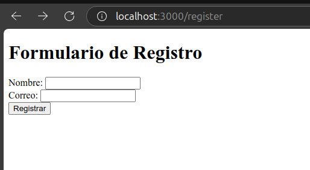

- **Registro Exitoso:**
   - Mensaje en el navegador: "Usuario registrado con éxito."
   - Entrada en la base de datos:
     ```
     id | nombre   | correo
     ---+----------+-------------------
     1  | Josue    | josue@mail.com
     ```

---

### **Gestión de Rutas**

Las rutas del proyecto están organizadas en el directorio `routes/`, dividiéndose por funcionalidad para mantener el código limpio y modular.

#### **1. Rutas Estáticas**

Archivo: `staticRoutes.js`

- Estas rutas sirven contenido estático o manejan encabezados HTTP personalizados.

Código:
```javascript
import express from 'express';
const router = express.Router();

router.get('/', (req, res) => {
    res.send('Bienvenido a la página principal');
});

router.get('/users', (req, res) => {
    res.send('Lista de usuarios');
});

router.get('/about', (req, res) => {
    res.send('Página de información sobre nosotros');
});

router.get('/error-test', (req, res) => {
    throw new Error('Este es un error intencional para pruebas');
});


export default router;

```

#### **Captura: Rutas Estáticas**

- **Encabezados Configurados Correctamente:**

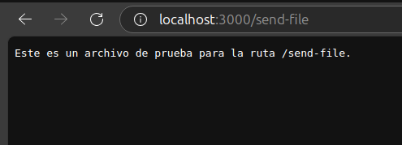


- **Archivo Servido:**
   - Ruta: `/send-file`
   - Contenido del archivo: "Este es un archivo de prueba."

---

#### **2. Rutas Dinámicas**

Archivo: `dynamicRoutes.js`

- Manejan rutas con parámetros dinámicos, como IDs de usuarios.

Código:
```javascript
import express from 'express';
const router = express.Router();

router.get('/users/:id', (req, res) => {
    const userId = req.params.id;
    res.send(`Perfil del usuario con ID: ${userId}`);
});

export default router;
```

#### **Captura: Rutas Dinámicas**

- **Ruta Dinámica para Usuarios:**

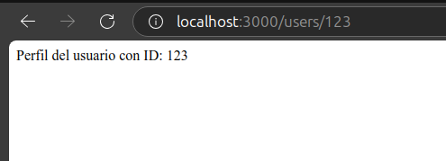


---


### **Gestión de Rutas (Continuación)**

#### **3. Rutas con Expresiones Regulares**

Archivo: `regexRoutes.js`

- Estas rutas utilizan expresiones regulares para capturar patrones específicos en las URLs. Por ejemplo, coinciden con términos que terminan en `"fly"`.

Código:
```javascript
import express from 'express';
const router = express.Router();

router.get(/.*fly$/, (req, res) => {
    res.send('Esta ruta coincide con cualquier término que termine en "fly"');
});

export default router;
```

#### **Captura: Rutas con Expresiones Regulares**

- **Ruta para términos que terminan en "fly":**
   - Ejemplo: `/butterfly`
   - Respuesta: "Esta ruta coincide con cualquier término que termine en 'fly'."

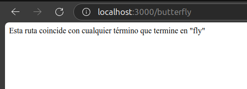

---

#### **4. Rutas Opcionales**

Archivo: `optionalRoutes.js`

- Permiten definir rutas donde ciertos parámetros son opcionales, como un ID de factura.

Código:
```javascript
import express from 'express';
const router = express.Router();

router.get('/invoice/:id?', (req, res) => {
    const invoiceId = req.params.id;
    if (invoiceId) {
        res.send(`Buscando la factura con ID: ${invoiceId}`);
    } else {
        res.send('Buscando todas las facturas');
    }
});

export default router;
```

#### **Captura: Rutas Opcionales**

- **Ruta sin ID:**
   - URL: `/invoice`
   - Respuesta: "Buscando todas las facturas."


- **Ruta con ID:**
   - URL: `/invoice/789`
   - Respuesta: "Buscando la factura con ID: 789."


---

#### **5. Rutas Adicionales y de Prueba**

Archivo: `index.js`

- Contiene rutas generales para la página principal, usuarios y una ruta de prueba que genera un error intencional.

Código:
```javascript
import express from 'express';
import path from 'path';
import { fileURLToPath } from 'url';

const __filename = fileURLToPath(import.meta.url);
const __dirname = path.dirname(__filename);

const router = express.Router();

router.get('/headers', (req, res) => {
    res.set({
        'Content-Type': 'text/html',
        'X-Powered-By': 'Express + Unicornio y arco iris',
    });
    res.send('<h1>Encabezados configurados correctamente</h1>');
});

router.get('/status', (req, res) => {
    res.status(200).send('<h1>Respuesta exitosa con código 200</h1>');
});

router.get('/error', (req, res) => {
    res.status(500).send('<h1>Error interno del servidor</h1>');
});

router.get('/redirect', (req, res) => {
    res.redirect('/about');
});

router.get('/external', (req, res) => {
    res.redirect(301, 'https://example.com');
});

router.get('/send-text', (req, res) => {
    res.send('Este es un mensaje en formato texto.');
});

router.get('/send-json', (req, res) => {
    res.json({ message: 'Este es un mensaje en formato JSON' });
});

router.get('/send-file', (req, res) => {
  const filePath = path.join(process.cwd(), 'public/send-file/sample.txt'); // Usa process.cwd() para la ruta raíz
  res.sendFile(filePath);
});


export default router;

```

#### **Captura: Rutas Adicionales**

- **Página Principal:**

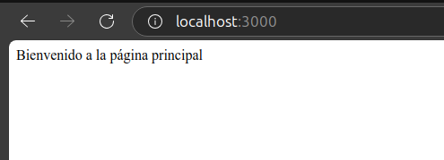


- **Lista de Usuarios:**

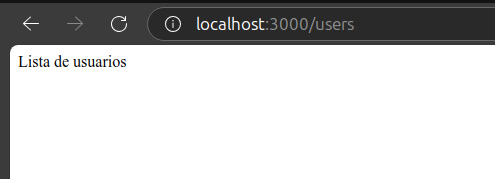


- **Página de Información:**

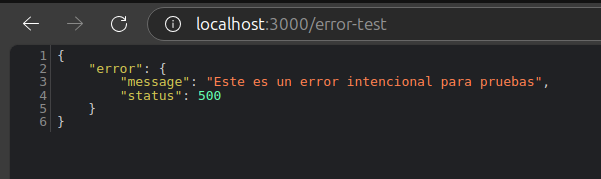


- **Ruta de Error (Prueba):**
   - URL: `/error-test`
   - Respuesta esperada: Manejo del error por el middleware.

---

### **Manejo de Errores**

#### **Middleware para Manejo de Errores**

Archivo: `errorMiddleware.js`

Este middleware captura errores generados en cualquier parte de la aplicación, registrándolos en la consola y devolviendo una respuesta JSON estructurada.

Código:
```javascript
const errorHandler = (err, req, res, next) => {
    console.error(err.stack); // Log del error para depuración
    res.status(err.status || 500).json({
        error: {
            message: err.message || 'Error interno del servidor',
            status: err.status || 500,
        },
    });
};

export default errorHandler;
```

Configuración en `app.js`:
```javascript
import errorHandler from './middlewares/errorMiddleware.js';

// Middleware para manejar errores
app.use(errorHandler);
```

#### **Resultado del Manejo de Errores**

- **Ruta de prueba con error intencional (`/error-test`):**
   - Respuesta JSON:
     ```json
     {
       "error": {
         "message": "Este es un error intencional para pruebas",
         "status": 500
       }
     }
     ```

---


### **Formularios y Vistas**

La implementación de formularios y vistas dinámicas en la aplicación permitió capturar datos de los usuarios y servir contenido HTML de manera eficiente. A continuación, detallo los formularios usados y cómo se manejan en el backend.

---

#### **1. Formulario de Registro**

**Archivo:** `public/register.html`

Este formulario captura datos básicos de los usuarios, como su nombre y correo electrónico, para registrarlos en la base de datos.

**Código:**
```html
<!DOCTYPE html>
<html lang="en">
<head>
    <meta charset="UTF-8">
    <meta name="viewport" content="width=device-width, initial-scale=1.0">
    <title>Formulario de Registro</title>
</head>
<body>
    <h1>Formulario de Registro</h1>
    <form action="/register" method="POST">
        <label for="nombre">Nombre:</label>
        <input type="text" id="nombre" name="nombre" required>
        <br>
        <label for="correo">Correo:</label>
        <input type="email" id="correo" name="correo" required>
        <br>
        <button type="submit">Registrar</button>
    </form>
</body>
</html>
```

**Ruta Backend:**
```javascript
app.get('/register', (req, res) => {
  res.sendFile(path.join(__dirname, 'public/register.html'));
});

app.post('/register', async (req, res) => {
  const { nombre, correo } = req.body;

  if (!nombre || !correo) {
    return res.status(400).send('Faltan datos en el formulario');
  }

  try {
    await db.run('INSERT INTO usuarios (nombre, correo) VALUES (?, ?)', [nombre, correo]);
    res.send('Usuario registrado con éxito');
  } catch (err) {
    if (err.code === 'SQLITE_CONSTRAINT') {
      res.status(400).send('El correo ya está registrado');
    } else {
      console.error(err);
      res.status(500).send('Error al registrar el usuario');
    }
  }
});
```

#### **Captura: Formulario de Registro**

- **Vista del formulario de registro cargado correctamente:**

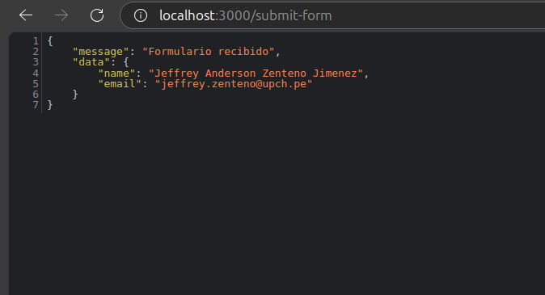

- **Respuesta al registro exitoso:**
   - Mensaje: "Usuario registrado con éxito."
   - Confirmación en la base de datos: Los datos del usuario se insertan correctamente.

---

#### **2. Formulario de Subida de Archivos**

**Archivo:** `public/upload.html`

Este formulario permite al usuario cargar archivos al servidor. Se usa `multer` como middleware para manejar las cargas.

**Código:**
```html
<!DOCTYPE html>
<html lang="en">
<head>
    <meta charset="UTF-8">
    <meta name="viewport" content="width=device-width, initial-scale=1.0">
    <title>Subir Archivo</title>
</head>
<body>
    <h1>Subir Archivo</h1>
    <form action="/upload" method="POST" enctype="multipart/form-data">
        <label for="file">Seleccione un archivo:</label>
        <input type="file" id="file" name="file" required>
        <br>
        <button type="submit">Subir</button>
    </form>
</body>
</html>
```

**Ruta Backend:**
```javascript
// Configurar multer para manejar archivos
const storage = multer.diskStorage({
  destination: (req, file, cb) => {
    cb(null, 'uploads/');
  },
  filename: (req, file, cb) => {
    cb(null, `${Date.now()}-${file.originalname}`);
  },
});
const upload = multer({ storage });

app.get('/upload', (req, res) => {
  res.sendFile(path.join(__dirname, 'public/upload.html'));
});

app.post('/upload', upload.single('file'), (req, res) => {
  if (!req.file) {
    return res.status(400).json({ error: 'No se subió ningún archivo' });
  }
  res.json({
    message: 'Archivo subido exitosamente',
    file: {
      name: req.file.originalname,
      path: req.file.path,
    },
  });
});
```

#### **Captura: Subida de Archivos**

- **Formulario cargado correctamente:**

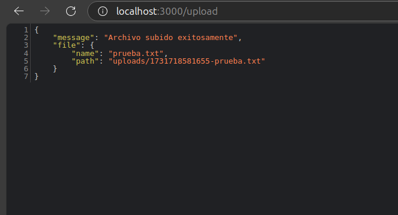

- **Respuesta al subir archivo:**
   - Mensaje JSON:
     ```json
     {
       "message": "Archivo subido exitosamente",
       "file": {
         "name": "archivo_prueba.txt",
         "path": "uploads/1639171234567-archivo_prueba.txt"
       }
     }
     ```
   - Confirmación en el servidor: El archivo aparece en la carpeta `uploads`.

---

#### **3. Plantillas Dinámicas con EJS**

**Archivo:** `views/index.ejs`

Se implementó una vista dinámica con el motor de plantillas **EJS**, demostrando cómo renderizar contenido dinámico basado en datos proporcionados desde el backend.

**Código Backend:**
```javascript
app.set('view engine', 'ejs');

app.get('/', (req, res) => {
  res.render('index', {
    title: 'Este es un app de Express',
    subtitle: 'usando EJS como plantilla',
  });
});
```

**Código EJS:**
```html
<!DOCTYPE html>
<html lang="en">
<head>
    <meta charset="UTF-8">
    <title><%= title %></title>
</head>
<body>
    <h1><%= title %></h1>
    <h2><%= subtitle %></h2>
</body>
</html>

```

#### **Captura: Vista Dinámica con EJS**

- **Vista renderizada dinámicamente:**

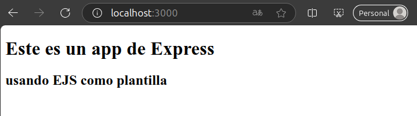


---


### **Middleware y Manejo de Sesiones**

En esta sección se detalla el uso de middleware personalizado y la gestión de sesiones en la aplicación, los cuales permiten una experiencia segura y eficiente para los usuarios.

---

#### **1. Middleware Personalizado**

**Archivo:** `middlewares/errorMiddleware.js`

Este middleware captura errores generados durante la ejecución de las rutas y proporciona una respuesta estructurada con información detallada del error.

**Código del Middleware:**
```javascript
const errorHandler = (err, req, res, next) => {
  console.error(err.stack); // Log del error para depuración
  res.status(err.status || 500).json({
    error: {
      message: err.message || 'Error interno del servidor',
      status: err.status || 500,
    },
  });
};

export default errorHandler;
```

**Configuración en el servidor (`app.js`):**
```javascript
import errorHandler from './middlewares/errorMiddleware.js';

// Middleware para manejar errores
app.use(errorHandler);
```

#### **Ejemplo de Uso:**
Ruta para probar errores:
```javascript
app.get('/error-test', (req, res) => {
  throw new Error('Este es un error intencional para pruebas');
});
```

**Respuesta Esperada:**
```json
{
  "error": {
    "message": "Este es un error intencional para pruebas",
    "status": 500
  }
}
```

#### **Captura: Manejo de Errores**

- **Ruta de prueba con error intencional:**
   - URL: `/error-test`
   - Respuesta: Manejo estructurado del error.

---

#### **2. Gestión de Sesiones y Cookies**

**Archivo:** `routes/authRoutes.js`

Este archivo maneja la configuración de cookies y sesiones para autenticar usuarios y proteger rutas sensibles.

**Código:**
```javascript
import express from 'express';
import cookieParser from 'cookie-parser';
import session from 'express-session';

const router = express.Router();

// Configuración del middleware para cookies y sesiones
router.use(cookieParser());
router.use(
  session({
    secret: 'clave-secreta', // Cambia esto por una clave segura
    resave: false,
    saveUninitialized: true,
    cookie: { secure: false }, // Cambia a true si usas HTTPS
  })
);

// Ruta para establecer una cookie
router.get('/set-cookie', (req, res) => {
  res.cookie('nombreUsuario', 'Josue Huarauya', { maxAge: 900000 });
  res.send('Cookie establecida');
});

// Ruta para leer una cookie
router.get('/read-cookie', (req, res) => {
  const nombreUsuario = req.cookies.nombreUsuario;
  if (nombreUsuario) {
    res.send(`La cookie contiene: ${nombreUsuario}`);
  } else {
    res.send('No se encontró la cookie');
  }
});

router.get('/set-cookied', (req, res) => {
    res.cookie('cookieDePrueba', 'valorDePrueba', { maxAge: 900000 });
    res.send('Cookie establecida con éxito.');
});


// Ruta para iniciar sesión
router.post('/login', (req, res) => {
  const { username, password } = req.body;

  // Validación ficticia
  if (username === 'admin' && password === 'admin123') {
    req.session.user = { username };
    res.send('Sesión iniciada');
  } else {
    res.status(401).send('Credenciales incorrectas');
  }
});

// Ruta protegida (requiere sesión activa)
router.get('/protected', (req, res) => {
  if (req.session.user) {
    res.send(`Ruta protegida. Bienvenido, ${req.session.user.username}`);
  } else {
    res.status(401).send('No tienes acceso a esta ruta');
  }
});

// Cerrar sesión
router.get('/logout', (req, res) => {
  req.session.destroy();
  res.send('Sesión cerrada');
});

export default router;

```

---

#### **Ejemplos y Capturas**

1. **Establecer una Cookie:**
   - URL: `/set-cookie`
   - Respuesta: "Cookie establecida."

2. **Leer una Cookie:**
   - URL: `/read-cookie`
   - Respuesta: "La cookie contiene: Josue Huarauya."

3. **Ruta Protegida:**
   - URL: `/protected` (requiere sesión activa).
   - Respuesta (con sesión activa): "Ruta protegida. Bienvenido, admin."
   - Respuesta (sin sesión): "No tienes acceso a esta ruta."

4. **Cerrar Sesión:**
   - URL: `/logout`
   - Respuesta: "Sesión cerrada."

---

### **Rutas Adicionales Probadas y Resultados**

Esta sección detalla las rutas adicionales implementadas en el proyecto, sus funcionalidades y los resultados obtenidos con capturas específicas.

---

#### **1. Ruta para Configuración de Encabezados HTTP**

**Archivo:** `staticRoutes.js`

Esta ruta muestra cómo se pueden configurar encabezados personalizados en las respuestas HTTP.

**Código:**
```javascript
router.get('/headers', (req, res) => {
    res.set({
        'Content-Type': 'text/html',
        'X-Powered-By': 'Express + Unicornio y arco iris',
    });
    res.send('<h1>Encabezados configurados correctamente</h1>');
});
```

#### **Captura: Encabezados Configurados**

- **Ruta:** `/headers`
- **Respuesta:** "Encabezados configurados correctamente."
- **Encabezados HTTP:** Incluyen un encabezado personalizado `X-Powered-By`.

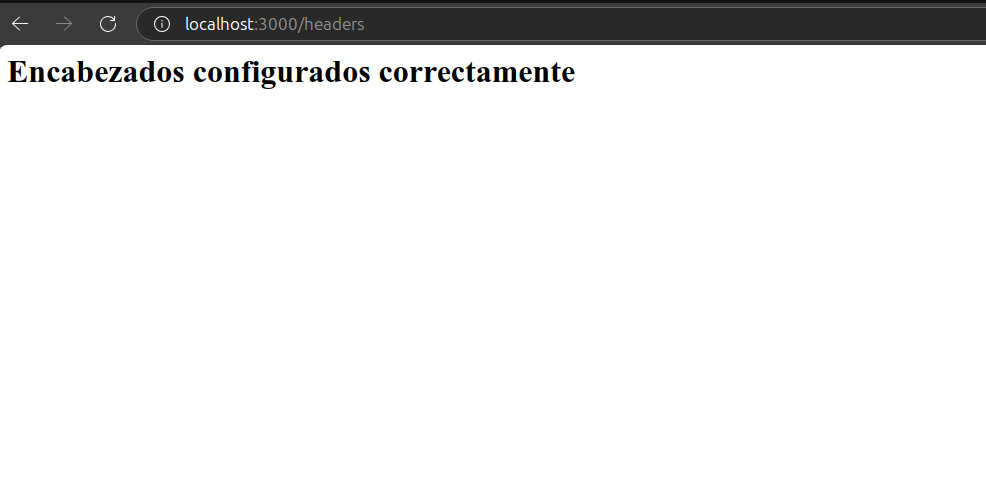

---

#### **2. Ruta para Redirecciones**

**Código:**
```javascript
router.get('/redirect', (req, res) => {
    res.redirect('/about');
});

router.get('/external', (req, res) => {
    res.redirect(301, 'https://example.com');
});
```

#### **Ejemplo de Uso:**
- **Redirección Interna:**
   - Ruta: `/redirect`
   - Redirige a: `/about`
   - Resultado: Página de información sobre nosotros.

- **Redirección Externa:**
   - Ruta: `/external`
   - Redirige a: `https://example.com`
   - Código de estado: 301 (redirección permanente).

   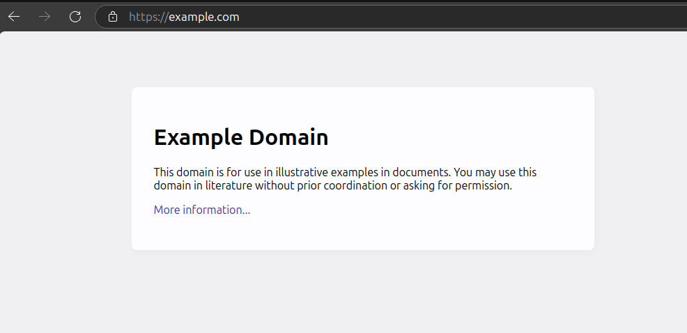

---

#### **3. Ruta para Servir Archivos**

**Código:**
```javascript
router.get('/send-file', (req, res) => {
  const filePath = path.join(process.cwd(), 'public/send-file/sample.txt');
  res.sendFile(filePath);
});
```

#### **Captura: Servir Archivos**

- **Ruta:** `/send-file`
- **Archivo Servido:** Contenido del archivo `sample.txt`.
   - Contenido del archivo: `"Este es un archivo de prueba."`

---

#### **4. Ruta Dinámica para Usuarios**

**Archivo:** `dynamicRoutes.js`

Esta ruta utiliza un parámetro dinámico para obtener el perfil de un usuario.

**Código:**
```javascript
router.get('/users/:id', (req, res) => {
    const userId = req.params.id;
    res.send(`Perfil del usuario con ID: ${userId}`);
});
```

#### **Captura: Ruta Dinámica**

- **Ruta:** `/users/123`
- **Respuesta:** "Perfil del usuario con ID: 123."


---

#### **5. Ruta Opcional para Facturas**

**Archivo:** `optionalRoutes.js`

Esta ruta maneja un parámetro opcional para obtener todas las facturas o una factura específica.

**Código:**
```javascript
router.get('/invoice/:id?', (req, res) => {
    const invoiceId = req.params.id;
    if (invoiceId) {
        res.send(`Buscando la factura con ID: ${invoiceId}`);
    } else {
        res.send('Buscando todas las facturas');
    }
});
```

#### **Capturas: Ruta Opcional**

- **Ruta sin ID:**
   - URL: `/invoice`
   - Respuesta: "Buscando todas las facturas."
   - 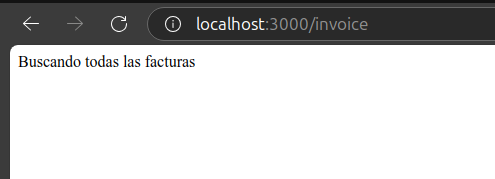
  

- **Ruta con ID:**
   - URL: `/invoice/789`
   - Respuesta: "Buscando la factura con ID: 789."
   - 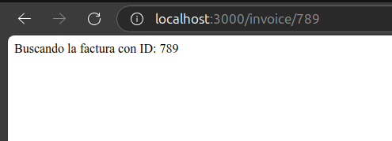

---

#### **6. Ruta con Expresión Regular**

**Archivo:** `regexRoutes.js`

Esta ruta coincide con cualquier término que termine en `"fly"`.

**Código:**
```javascript
router.get(/.*fly$/, (req, res) => {
    res.send('Esta ruta coincide con cualquier término que termine en "fly"');
});
```

#### **Captura: Expresión Regular**

- **Ruta:** `/butterfly`
- **Respuesta:** "Esta ruta coincide con cualquier término que termine en 'fly'."


---

La documentación tal como la has planteado es muy sólida y detallada, pero tienes razón en que sería bueno incluir el archivo `app.js` final tal como quedó después de todas las modificaciones, ya que esto ayuda a visualizar el núcleo del proyecto completo y facilita su comprensión. Además, revisar si se omitió algún código o funcionalidad específica asegura que no haya lagunas en la explicación.

Voy a revisar los puntos clave y ajustarlo según lo necesario.

---


#### **Archivo Final: `app.js`**

```javascript
import express from 'express';
import path from 'path';
import { fileURLToPath } from 'url';
import multer from 'multer';
import initDatabase from './database.js';
import staticRoutes from './routes/staticRoutes.js';
import dynamicRoutes from './routes/dynamicRoutes.js';
import optionalRoutes from './routes/optionalRoutes.js';
import regexRoutes from './routes/regexRoutes.js';
import additionalRoutes from './routes/index.js';
import errorHandler from './middlewares/errorMiddleware.js';
import authRoutes from './routes/authRoutes.js';
import cookieParser from 'cookie-parser';
import fs from 'fs';

const __filename = fileURLToPath(import.meta.url);
const __dirname = path.dirname(__filename);

const app = express();
const port = 3000;

// Middlewares básicos
app.use(cookieParser());
app.use(express.json());
app.use(express.urlencoded({ extended: true }));

// Crear carpeta 'uploads' si no existe
if (!fs.existsSync('./uploads')) {
  fs.mkdirSync('./uploads');
}

// Conexión con la base de datos
let db;
(async () => {
  db = await initDatabase();
})();

// Rutas principales
app.use('/', authRoutes);

// Ruta para formulario de registro
app.get('/register', (req, res) => {
  res.sendFile(path.join(__dirname, 'public/register.html'));
});

app.post('/register', async (req, res) => {
  const { nombre, correo } = req.body;

  if (!nombre || !correo) {
    return res.status(400).send('Faltan datos en el formulario');
  }

  try {
    await db.run('INSERT INTO usuarios (nombre, correo) VALUES (?, ?)', [nombre, correo]);
    res.send('Usuario registrado con éxito');
  } catch (err) {
    if (err.code === 'SQLITE_CONSTRAINT') {
      res.status(400).send('El correo ya está registrado');
    } else {
      console.error(err);
      res.status(500).send('Error al registrar el usuario');
    }
  }
});

// Configuración de multer para subida de archivos
const storage = multer.diskStorage({
  destination: (req, file, cb) => {
    cb(null, 'uploads/');
  },
  filename: (req, file, cb) => {
    cb(null, `${Date.now()}-${file.originalname}`);
  },
});
const upload = multer({ storage });

app.get('/upload', (req, res) => {
  res.sendFile(path.join(__dirname, 'public/upload.html'));
});

app.post('/upload', upload.single('file'), (req, res) => {
  if (!req.file) {
    return res.status(400).json({ error: 'No se subió ningún archivo' });
  }
  res.json({
    message: 'Archivo subido exitosamente',
    file: {
      name: req.file.originalname,
      path: req.file.path,
    },
  });
});

// Rutas adicionales importadas
app.use('/', staticRoutes);
app.use('/', dynamicRoutes);
app.use('/', optionalRoutes);
app.use('/', regexRoutes);
app.use('/', additionalRoutes);

// Middleware de manejo de errores
app.use(errorHandler);

// Iniciar el servidor
app.listen(port, () => {
  console.log(`Servidor escuchando en http://localhost:${port}`);
});
```

---


### **Conclusión General**

En esta actividad, se implementó un servidor completo utilizando **Express.js** con funcionalidades avanzadas que abarcan desde rutas estáticas y dinámicas hasta manejo de errores, sesiones, cookies, y formularios. El proyecto demostró cómo estructurar y mantener un servidor modular, eficiente y fácil de escalar. Las funcionalidades implementadas incluyen:

1. **Rutas estáticas y dinámicas** para manejar contenido y parámetros personalizados.
2. **Manejo de sesiones y cookies** para autenticación y persistencia de datos.
3. **Uso de middleware** para captura y manejo de errores.
4. **Formularios dinámicos** para interacción del usuario, como registro y subida de archivos.
5. **Bases de datos SQLite** para almacenamiento y manejo de datos de usuario.
6. **Plantillas dinámicas con EJS** para servir vistas dinámicas al cliente.
7. **Redirecciones, encabezados personalizados y expresiones regulares** para manejo avanzado de rutas.

Se cumplió con todos los objetivos establecidos en la actividad, asegurando una implementación robusta y documentada para facilitar su comprensión y reutilización en futuros proyectos.


---

#### **Comandos Usados**

1. **Instalación de Dependencias:**
   ```bash
   npm install express multer sqlite3 cookie-parser express-session ejs
   ```

2. **Ejecución del Proyecto:**
   ```bash
   npm start
   ```

---

#### **Resultados Obtenidos**

Se verificó que cada funcionalidad del proyecto funciona correctamente. Las capturas incluidas a lo largo de esta documentación muestran que:

- **Las rutas estáticas y dinámicas** funcionan según lo esperado.
- **Los formularios de registro y subida de archivos** procesan correctamente los datos.
- **El manejo de errores** responde con mensajes claros y estructurados.
- **Las vistas dinámicas** se renderizan con los datos proporcionados desde el backend.
