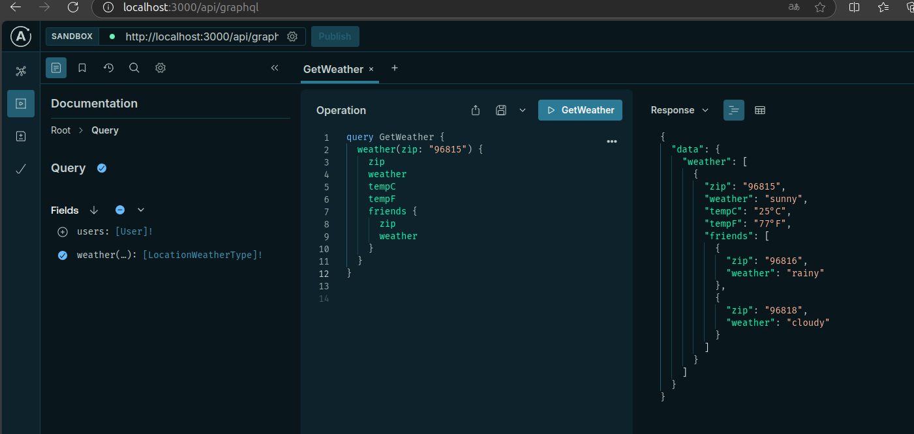

# **Actividad 13: Agregar una API GraphQL a Next.js**

### **Introducción**
Esta actividad implementa una API GraphQL utilizando **Next.js** y **Apollo Server**, con resolvers para manejar datos ficticios relacionados con información meteorológica y usuarios. El sistema incluye autenticación mediante middleware, soporte para consultas y mutaciones, y un entorno de prueba mediante Apollo Sandbox.

Los objetivos principales incluyen:
- Aplicar middlewares de autenticación y CORS.
- Crear resolvers robustos para consultas y mutaciones.
- Utilizar Apollo Server para gestionar las operaciones de GraphQL.
- Garantizar que las operaciones cumplan con los requisitos de seguridad y validación.

---

### **Flujo completo de funcionamiento**

Se explica el flujo completo desde que un cliente realiza una solicitud hasta que recibe una respuesta de la API GraphQL.


1. **Envío de la solicitud:**
   - El cliente (por ejemplo, Apollo Sandbox o una aplicación externa) envía una consulta o mutación a la URL de la API GraphQL (`http://localhost:3000/api/graphql`).
   - La solicitud incluye los datos necesarios, como parámetros de la consulta o el payload para las mutaciones.

2. **Validación inicial (Middlewares):**
   - **CORS:** El middleware `allowCors` se asegura de que la solicitud sea válida y acepta orígenes externos, manejando encabezados y métodos permitidos.
   - **Autenticación:** El middleware `authMiddleware` verifica si el encabezado `Authorization` contiene un token válido. Si el token falta o es incorrecto, la API responde con un error `401 Unauthorized` y el flujo termina aquí.

3. **Procesamiento por Apollo Server:**
   - Una vez que la solicitud pasa los middlewares, Apollo Server toma el control.
   - Verifica el esquema (`typeDefs`) para asegurarse de que la consulta o mutación solicitada sea válida y esté definida.

4. **Ejecución de Resolvers:**
   - Apollo Server delega la lógica al resolver correspondiente:
     - Si es una consulta (`Query`), el resolver busca los datos en la base ficticia (`db`).
     - Si es una mutación (`Mutation`), el resolver agrega o modifica los datos en la base, validando reglas como evitar duplicados o que las referencias sean válidas.
   - Los resolvers también manejan cualquier error relacionado, como intentar usar un código postal inexistente en `friends`.

5. **Respuesta de la API:**
   - Apollo Server devuelve los datos solicitados en formato JSON.
   - En el caso de éxito, incluye los datos solicitados o confirmación de que la operación (mutación) fue completada.
   - En caso de error, retorna un mensaje claro, indicando qué ocurrió mal, como códigos duplicados o tokens inválidos.

6. **Visualización del resultado:**
   - El cliente recibe la respuesta y, dependiendo de la herramienta utilizada (Apollo Sandbox, frontend u otra aplicación), presenta los datos al usuario final.


---

### **3. Esquema de GraphQL**

**Archivo:** `graphql/schema.ts`

El esquema define la estructura de los datos disponibles en la API GraphQL. Incluye los tipos, las consultas y las mutaciones que el cliente puede realizar.

#### **Código:**
```typescript
import gql from "graphql-tag";

// Definición del esquema de GraphQL
export const typeDefs = gql`
  # Tipo para representar el clima en una ubicación
  type LocationWeatherType {
    zip: String!         # Código postal, único para cada ubicación
    weather: String!     # Descripción del clima (soleado, lluvioso, etc.)
    tempC: String!       # Temperatura en grados Celsius
    tempF: String!       # Temperatura en grados Fahrenheit
    friends: [LocationWeatherType]! # Lista de ubicaciones relacionadas
  }

  # Tipo para representar un usuario
  type User {
    id: ID!              # Identificador único del usuario
    name: String!        # Nombre del usuario
    email: String!       # Correo electrónico del usuario
    location: LocationWeatherType! # Ubicación asociada al usuario
  }

  # Entrada para mutaciones (nuevo clima)
  input LocationWeatherInput {
    zip: String!         # Código postal
    weather: String!     # Clima
    tempC: String!       # Temperatura en Celsius
    tempF: String!       # Temperatura en Fahrenheit
    friends: [String]!   # Códigos postales relacionados
  }

  # Consultas disponibles
  type Query {
    # Consulta para obtener información climática
    weather(zip: String, limit: Int, offset: Int): [LocationWeatherType]!

    # Consulta para obtener usuarios
    users: [User]!
  }

  # Mutaciones disponibles
  type Mutation {
    # Mutación para agregar nueva información climática
    addWeather(data: LocationWeatherInput!): LocationWeatherType!
  }
`;
```

**Comentarios:**
1. **Estructura clara:** Cada tipo está diseñado para reflejar las necesidades del proyecto.
2. **Mutaciones:** Permiten agregar nuevos datos, como información climática.
3. **Consultas:** Incluyen filtros opcionales (`zip`, `limit`, `offset`) para mayor flexibilidad.

---

### **4. Resolvers**

**Archivo:** `graphql/resolvers.ts`

Los resolvers implementan la lógica detrás de cada consulta y mutación definida en el esquema.

#### **Código:**
```typescript
import { db, users } from "./data";

// Interfaz para la entrada de datos de clima
declare interface WeatherInterface {
  zip: string;
  weather: string;
  tempC: string;
  tempF: string;
  friends: string[];
}

// Lógica de los resolvers
export const resolvers = {
  Query: {
    // Resolver para obtener información climática
    weather: (_: any, { zip, limit, offset }: { zip?: string; limit?: number; offset?: number }) => {
      let result = db;

      // Filtrar por código postal si se proporciona
      if (zip) {
        result = result.filter((item) => item.zip === zip);
      }

      // Aplicar paginación con offset
      if (offset !== undefined) {
        result = result.slice(offset);
      }

      // Limitar el número de resultados
      if (limit !== undefined) {
        result = result.slice(0, limit);
      }

      // Mapear las ubicaciones relacionadas (friends)
      return result.map((location) => ({
        ...location,
        friends: location.friends.map((friendZip) => db.find((item) => item.zip === friendZip)),
      }));
    },

    // Resolver para obtener usuarios
    users: () => users,
  },

   Mutation: {
    addWeather: (_: any, { data }: { data: WeatherInterface }) => {
      // Verificar si ya existe el código postal
      const existing = db.find((item) => item.zip === data.zip);
      if (existing) {
        throw new Error("Zip code already exists.");
      }
  
      // Validar que los códigos postales en friends existan en la base de datos
      const validatedFriends = data.friends.map((friendZip) => {
        const friend = db.find((item) => item.zip === friendZip);
        if (!friend) {
          throw new Error(`Friend with zip code ${friendZip} does not exist.`);
        }
        return friendZip;
      });
  
      // Agregar el nuevo dato con los friends validados
      const newWeather = { ...data, friends: validatedFriends };
      db.push(newWeather);
  
      // Devolver el nuevo dato completo, resolviendo los friends
      return {
        ...newWeather,
        friends: validatedFriends.map((friendZip) => db.find((item) => item.zip === friendZip)),
      };
    },
  }
}  
```

**Comentarios:**
1. **Consultas:**
   - `weather`: Soporta filtros (`zip`) y paginación (`limit`, `offset`).
   - `users`: Retorna todos los usuarios en el sistema.
2. **Mutaciones:**
   - `addWeather`: Valida que el código postal sea único antes de agregarlo.

---

### **Ejemplo de uso**

**Consulta para obtener el clima de una ubicación específica:**
```graphql
query GetWeather {
  weather(zip: "96815") {
    zip
    weather
    tempC
    tempF
    friends {
      zip
      weather
    }
  }
}
```

**Captura del resultado en Apollo Sandbox:**



---

### **5. Datos ficticios**

**Archivo:** `graphql/data.ts`

Este archivo contiene los datos ficticios que se utilizan en las consultas y mutaciones para simular una base de datos. Incluye información meteorológica y datos de usuarios relacionados.

#### **Código:**
```typescript
// Base de datos ficticia con información del clima
export const db = [
  {
    zip: "96815",
    weather: "sunny",          // Clima soleado
    tempC: "25°C",             // Temperatura en Celsius
    tempF: "77°F",             // Temperatura en Fahrenheit
    friends: ["96816", "96818"], // Códigos postales relacionados
  },
  {
    zip: "96816",
    weather: "rainy",          // Clima lluvioso
    tempC: "22°C",             // Temperatura en Celsius
    tempF: "71°F",             // Temperatura en Fahrenheit
    friends: ["96815", "96818"], // Códigos postales relacionados
  },
  {
    zip: "96818",
    weather: "cloudy",         // Clima nublado
    tempC: "20°C",             // Temperatura en Celsius
    tempF: "68°F",             // Temperatura en Fahrenheit
    friends: ["96816", "96815"], // Códigos postales relacionados
  },
];

// Base de datos ficticia con información de usuarios
export const users = [
  {
    id: "1",                     // Identificador del usuario
    name: "Josue",               // Nombre del usuario
    email: "josue@example.com",  // Correo electrónico
    location: db[0],             // Ubicación asociada (primer elemento de la base de datos climática)
  },
  {
    id: "2",                     // Identificador del usuario
    name: "Angely",              // Nombre del usuario
    email: "angely@example.com", // Correo electrónico
    location: db[1],             // Ubicación asociada (segundo elemento de la base de datos climática)
  },
];
```

**Comentarios:**
1. **`db` (clima):** Simula información de ubicaciones con sus condiciones meteorológicas y relaciones con otras ubicaciones (friends).
2. **`users`:** Representa usuarios vinculados a las ubicaciones de la base de datos climática.

---

### **6. Archivo principal de la API**

**Archivo:** `pages/api/graphql.ts`

Este archivo configura y expone la API GraphQL utilizando **Apollo Server** y los middlewares implementados.

#### **Código:**
```typescript
import { ApolloServer } from '@apollo/server';
import { startServerAndCreateNextHandler } from '@as-integrations/next';
import { typeDefs } from '../../graphql/schema';          // Esquema de GraphQL
import { resolvers } from '../../graphql/resolvers';      // Resolvers de GraphQL
import authMiddleware from '../../graphql/middlewares/authMiddleware'; // Middleware de autenticación
import allowCors from '../../graphql/middlewares/allowCors';           // Middleware de CORS

// Crear el servidor de Apollo
const server = new ApolloServer({
  typeDefs,                    // Esquema de GraphQL
  resolvers,                   // Resolvers de GraphQL
  introspection: true,         // Habilita introspección para Apollo Sandbox
});

// Crear el handler para manejar solicitudes
const handler = startServerAndCreateNextHandler(server);

// Aplicar middlewares: CORS y autenticación
export default allowCors(authMiddleware(handler));
```

**Comentarios:**
1. **`ApolloServer`:** Configura el servidor con el esquema y los resolvers definidos.
2. **Middlewares:**
   - `allowCors`: Maneja solicitudes entre diferentes orígenes.
   - `authMiddleware`: Valida el encabezado de autorización.
3. **`introspection`:** Habilitado para permitir el uso de Apollo Sandbox.

---

### **7. Middleware de prueba**

**Archivo:** `pages/api/test.ts`

Este archivo verifica que el middleware de autenticación esté funcionando correctamente.

#### **Código:**
```typescript
import { NextApiRequest, NextApiResponse } from "next";
import authMiddleware from "../../graphql/middlewares/authMiddleware"; // Middleware de autenticación

// Handler de prueba
const testHandler = async (req: NextApiRequest, res: NextApiResponse) => {
  res.status(200).json({ message: "Authorized! Middleware is working correctly." });
};

// Exportar el handler envuelto con el middleware
export default authMiddleware(testHandler);
```

**Comentarios:**
- **Propósito:** Probar el middleware sin ejecutar consultas completas de GraphQL.
- **Respuesta:** Retorna un mensaje de éxito si el middleware valida correctamente la autorización.

---

### **8. Ejemplo de mutación**

**Consulta para agregar datos climáticos:**
```graphql
mutation AddWeather {
  addWeather(data: {
    zip: "96820",
    weather: "windy",
    tempC: "18°C",
    tempF: "64°F",
    friends: ["96815"]
  }) {
    zip
    weather
    tempC
    tempF
    friends {
      zip
      weather
    }
  }
}
```

**Captura del resultado en Apollo Sandbox:**


---
### **9. Resultado de ejecución de mutaciones y consultas**

#### **Ejecución de consultas**
**Consulta:** Obtener información del clima en un código postal específico (`96815`) junto con las ubicaciones relacionadas.
```graphql
query GetWeather {
  weather(zip: "96815") {
    zip
    weather
    tempC
    tempF
    friends {
      zip
      weather
    }
  }
}
```

**Captura del resultado en Apollo Sandbox:**
```json
{
  "data": {
    "weather": [
      {
        "zip": "96815",
        "weather": "sunny",
        "tempC": "25°C",
        "tempF": "77°F",
        "friends": [
          {
            "zip": "96816",
            "weather": "rainy"
          },
          {
            "zip": "96818",
            "weather": "cloudy"
          }
        ]
      }
    ]
  }
}
```

**Comentarios:**
- La consulta muestra las condiciones climáticas del código postal `96815` y detalla el clima de sus ubicaciones relacionadas (`96816` y `96818`).

---

#### **Ejecución de mutaciones**
**Mutación:** Agregar una nueva ubicación con datos climáticos.
```graphql
mutation AddWeather {
  addWeather(data: {
    zip: "96820",
    weather: "windy",
    tempC: "18°C",
    tempF: "64°F",
    friends: ["96815"]
  }) {
    zip
    weather
    tempC
    tempF
    friends {
      zip
      weather
    }
  }
}
```

**Captura del resultado en Apollo Sandbox:**
```json
{
  "data": {
    "addWeather": {
      "zip": "96820",
      "weather": "windy",
      "tempC": "18°C",
      "tempF": "64°F",
      "friends": [
        {
          "zip": "96815",
          "weather": "sunny"
        }
      ]
    }
  }
}
```

**Comentarios:**
- La mutación agrega exitosamente el código postal `96820` y establece una relación con el código `96815`.

---

### **10. Estructura de archivos del proyecto**
La estructura completa del proyecto, con los nombres de los archivos relevantes, se detalla a continuación:

```
Actividad13/
├── graphql/
│   ├── middlewares/
│   │   ├── allowCors.ts         # Middleware para CORS
│   │   ├── authMiddleware.ts    # Middleware para autenticación
│   ├── data.ts                  # Datos ficticios
│   ├── resolvers.ts             # Resolvers de GraphQL
│   ├── schema.ts                # Esquema de GraphQL
├── pages/api/
│   ├── graphql.ts               # Punto de entrada de la API GraphQL
│   ├── test.ts                  # Middleware de prueba
├── package.json                 # Dependencias del proyecto
├── tsconfig.json                # Configuración de TypeScript
```

---

### **Preguntas Teóricas**

Se responde a las preguntas teóricas relacionadas con los conceptos básicos de GraphQL, el esquema, los resolvers, la configuración de CORS y las diferencias entre consultas y mutaciones. Estas respuestas buscan reflejar un entendimiento claro y completo.

---

#### **1. Conceptos básicos de GraphQL**
**Pregunta:**  
¿Cuál es la diferencia principal entre GraphQL y REST en términos de cómo manejan las solicitudes y las respuestas?

**Respuesta:**  
La diferencia principal entre GraphQL y REST radica en la flexibilidad al manejar las solicitudes y respuestas. En REST, las solicitudes se hacen a endpoints fijos (por ejemplo, `/users`, `/posts`), y cada uno devuelve un conjunto predeterminado de datos. Esto puede llevar a problemas como "over-fetching" (cuando se reciben más datos de los necesarios) o "under-fetching" (cuando no se obtienen suficientes datos y se requieren múltiples solicitudes).

En GraphQL, hay un único endpoint para todas las operaciones, y el cliente define exactamente qué datos necesita en una consulta o mutación. Esto elimina el problema de obtener datos innecesarios o insuficientes, haciendo las solicitudes más eficientes y específicas.

---

#### **2. Esquema de GraphQL**
**Pregunta:**  
Explica la importancia de definir un esquema (typeDefs) en GraphQL y cómo influye en las consultas y mutaciones.

**Respuesta:**  
El esquema (typeDefs) es el núcleo de una API GraphQL, ya que define la estructura de los datos disponibles y las operaciones permitidas. Es como un contrato entre el cliente y el servidor. Este esquema especifica:
- Los tipos de datos (por ejemplo, `User`, `LocationWeatherType`).
- Las consultas (`Query`) que el cliente puede realizar.
- Las mutaciones (`Mutation`) disponibles para modificar los datos.

El esquema asegura que las solicitudes sean válidas antes de llegar a los resolvers. Si una solicitud no coincide con el esquema, Apollo Server devuelve un error, lo que ayuda a mantener la integridad de los datos y la consistencia en las operaciones.

---

#### **3. Resolvers**
**Pregunta:**  
¿Qué es un resolver en GraphQL y cuál es su función dentro de una API GraphQL?

**Respuesta:**  
Un resolver en GraphQL es una función que implementa la lógica para obtener o manipular los datos asociados a un campo específico en el esquema. Cada consulta o mutación definida en el esquema tiene un resolver correspondiente que se ejecuta cuando el cliente realiza una solicitud.

Por ejemplo:
- En una consulta como `weather(zip: "96815")`, el resolver de `weather` se encarga de buscar en la base de datos ficticia el clima para el código postal `96815`.
- En una mutación como `addWeather`, el resolver valida los datos proporcionados, actualiza la base de datos y devuelve el nuevo registro.

En resumen, los resolvers conectan el esquema con los datos reales o la lógica de negocio.

---

#### **4. CORS en APIs**
**Pregunta:**  
¿Por qué es necesario configurar los encabezados CORS en la API GraphQL y qué problemas podrían surgir si no se hace correctamente?

**Respuesta:**  
CORS (Cross-Origin Resource Sharing) es una política de seguridad que restringe cómo se pueden realizar solicitudes desde un dominio diferente al del servidor. Es necesario configurar los encabezados CORS para permitir que aplicaciones front-end que se ejecuten en otros dominios (por ejemplo, `http://localhost:3000` y `http://localhost:4000`) puedan acceder a la API GraphQL.

Si no se configuran correctamente, pueden surgir errores como `Access-Control-Allow-Origin` bloqueado por el navegador, lo que impediría que los clientes accedan a la API. Esto es especialmente importante en aplicaciones distribuidas, donde el cliente y el servidor suelen estar alojados en dominios distintos.

---

#### **5. Mutaciones vs Consultas**
**Pregunta:**  
¿Cuál es la diferencia entre una consulta (Query) y una mutación (Mutation) en GraphQL?

**Respuesta:**  
En GraphQL, las consultas (`Query`) se utilizan para leer datos sin modificar el estado del servidor. Por ejemplo, obtener información climática o datos de usuarios es una consulta. Las consultas son operaciones de solo lectura.

Por otro lado, las mutaciones (`Mutation`) se utilizan para modificar los datos en el servidor, como agregar un nuevo clima (`addWeather`) o actualizar información de un usuario. Las mutaciones no solo cambian los datos en el servidor, sino que también devuelven los datos modificados o el resultado de la operación.

---

### **11. Conclusión**
La actividad se completó satisfactoriamente, cumpliendo con los siguientes aspectos:

1. **Creación de la API GraphQL:** Se implementó utilizando **Apollo Server** y **Next.js**.
2. **Middleware robusto:** Se configuraron middlewares para **CORS** y **autenticación**, garantizando seguridad en las solicitudes.
3. **Consultas y mutaciones funcionales:** La API soporta operaciones para consultar y agregar datos meteorológicos.
4. **Pruebas exitosas:** Todas las operaciones fueron probadas en **Apollo Sandbox**, mostrando resultados esperados.
