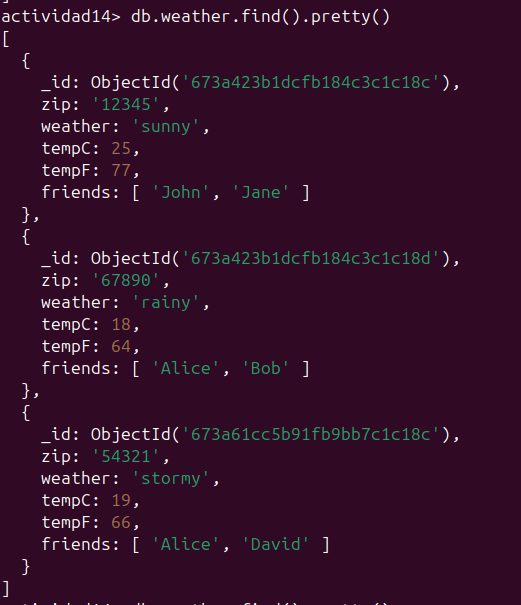
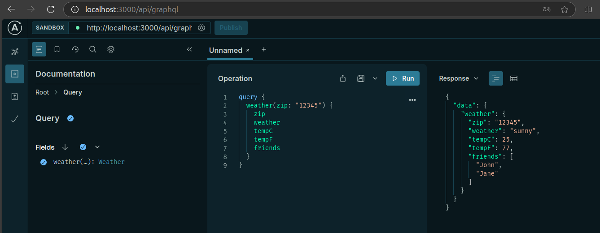
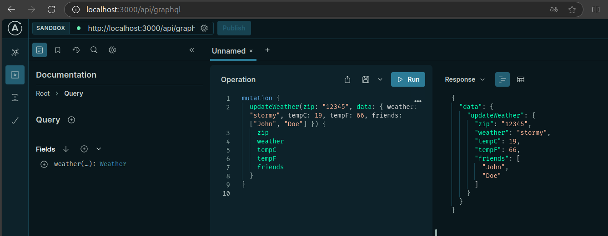
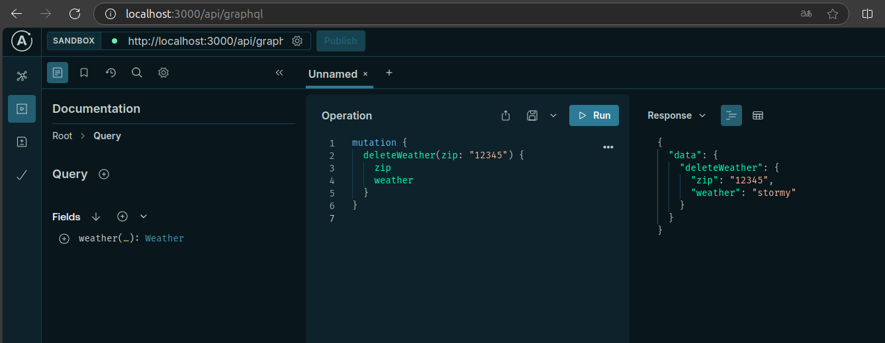
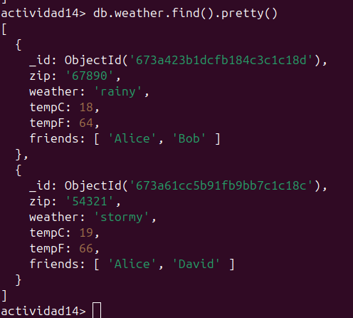

# **Actividad 14: API GraphQL con MongoDB y Mongoose**

### **Introducción**

En esta actividad desarrollé una API GraphQL con **Next.js**, **Apollo Server**, y **Mongoose**, para manejar datos meteorológicos almacenados en una base de datos MongoDB. Implementé resolvers robustos que conectan la API con la base de datos, middlewares para manejo de CORS y conexión a MongoDB, y soporte para operaciones como consultas y mutaciones.

Los objetivos principales fueron:
- Integrar una base de datos MongoDB con Mongoose.
- Implementar resolvers reutilizables y bien estructurados.
- Configurar middlewares para manejar la conexión y la seguridad.
- Probar las funcionalidades con consultas y mutaciones en Apollo Sandbox.

---

### **Flujo Completo de Funcionamiento**

El sistema se encarga de recibir solicitudes del cliente, validarlas, procesarlas y devolver los datos correspondientes. A continuación, detallo el flujo:

1. **Envío de la Solicitud:**
   - Un cliente, como **Apollo Sandbox** o una aplicación externa, realiza consultas o mutaciones a la URL de la API GraphQL: `http://localhost:3000/api/graphql`.
   - Las solicitudes incluyen parámetros necesarios como el código postal para consultar información meteorológica o datos para crear nuevos registros.

2. **Middlewares:**
   - **CORS:** Configurado para restringir solicitudes a dominios específicos y métodos permitidos, garantizando un entorno seguro.
   - **Conexión a MongoDB:** Un middleware conecta con MongoDB utilizando Mongoose. Maneja errores y evita conexiones duplicadas.

3. **Procesamiento por Apollo Server:**
   - Apollo Server valida la consulta o mutación con base en el esquema (`typeDefs`).
   - Si es válida, delega la lógica a los resolvers correspondientes.

4. **Ejecución de Resolvers:**
   - Los resolvers interactúan con la base de datos a través de servicios implementados con Mongoose. Por ejemplo:
     - Las consultas buscan datos meteorológicos por código postal.
     - Las mutaciones actualizan o eliminan registros existentes.
   - Los errores se manejan para devolver mensajes claros al cliente.

5. **Respuesta de la API:**
   - La API GraphQL responde con un objeto JSON que contiene los datos solicitados o mensajes de error detallados.

6. **Visualización del Resultado:**
   - Los datos devueltos se visualizan en Apollo Sandbox u otras herramientas front-end conectadas.

---

### **Estructura del Proyecto**

La estructura de carpetas fue organizada para mantener un código modular y limpio. Aquí está el árbol de directorios:

```
Actividad14/
├── graphql/                     # Archivos relacionados con GraphQL
│   ├── resolvers.ts             # Lógica para consultas y mutaciones
│   ├── schema.ts                # Definición del esquema de GraphQL
├── middleware/                  # Middleware para manejo de conexiones
│   ├── db-connect.ts            # Configuración y conexión a MongoDB
├── mongoose/                    # Modelos y servicios de datos
│   └── weather/                 # Directorio para la colección "weather"
│       ├── services.ts          # Funciones para interactuar con MongoDB
│       ├── weatherModel.ts      # Definición del modelo de datos en Mongoose
├── pages/                       # Punto de entrada de las APIs en Next.js
│   └── api/
│       └── graphql.ts           # Configuración de Apollo Server y middlewares
├── .env                         # Variables de entorno (URL de MongoDB, etc.)
├── package.json                 # Dependencias del proyecto
├── tsconfig.json                # Configuración de TypeScript
```

**Descripción breve de cada archivo importante:**
1. **`schema.ts`**: Define el esquema de GraphQL (tipos, consultas y mutaciones).
2. **`resolvers.ts`**: Contiene la lógica que ejecuta cada consulta y mutación.
3. **`db-connect.ts`**: Configura la conexión a MongoDB, optimizando las reconexiones.
4. **`services.ts`**: Funciones reutilizables para buscar, actualizar y eliminar datos en MongoDB.
5. **`graphql.ts`**: Configura Apollo Server con el esquema, resolvers y middlewares.

---

### **Esquema de GraphQL (typeDefs)**

**Archivo:** `graphql/schema.ts`

En este archivo definí el esquema que organiza las consultas y mutaciones disponibles en la API. Aquí está el código completo con comentarios línea por línea:

```typescript
import gql from "graphql-tag"; // Importa gql para definir el esquema de GraphQL

// Definición del esquema de GraphQL
export const typeDefs = gql`
  # Tipo que representa los datos meteorológicos
  type Weather {
    zip: String!         # Código postal único para cada registro
    weather: String!     # Estado del clima (e.g., "soleado", "lluvioso")
    tempC: Int!          # Temperatura en grados Celsius
    tempF: Int!          # Temperatura en grados Fahrenheit
    friends: [String]!   # Lista de códigos postales relacionados
  }

  # Entrada para enviar datos en mutaciones
  input WeatherInput {
    weather: String!     # Nuevo estado del clima
    tempC: Int!          # Nueva temperatura en Celsius
    tempF: Int!          # Nueva temperatura en Fahrenheit
    friends: [String]!   # Nuevas relaciones con otros códigos postales
  }

  # Consultas disponibles
  type Query {
    weather(zip: String!): Weather # Consulta para obtener datos por código postal
  }

  # Mutaciones disponibles
  type Mutation {
    updateWeather(zip: String!, data: WeatherInput!): Weather # Actualiza un registro
    deleteWeather(zip: String!): Weather                     # Elimina un registro
  }
`;
```

**Explicación de los elementos principales:**
- **Tipo `Weather`**: Representa un registro meteorológico, con campos como `zip` (código postal) y `weather` (estado del clima).
- **`WeatherInput`**: Estructura que valida los datos enviados en mutaciones.
- **Consultas**:
  - **`weather(zip)`**: Recupera información meteorológica para un código postal específico.
- **Mutaciones**:
  - **`updateWeather`**: Actualiza un registro existente.
  - **`deleteWeather`**: Elimina un registro por su código postal.

---

### **Resolvers**

**Archivo:** `graphql/resolvers.ts`

Los resolvers implementan la lógica para las operaciones definidas en el esquema. Aquí está el código completo con explicaciones detalladas:

```typescript
import { findByZip, updateByZip, deleteByZip } from '../mongoose/weather/services'; // Importa funciones para interactuar con MongoDB

// Definición de los resolvers
export const resolvers = {
  Query: {
    // Consulta para obtener datos por código postal
    weather: async (_: any, { zip }: { zip: string }) => {
      try {
        console.log(`Buscando información para ZIP: ${zip}`); // Log para depuración
        const weatherData = await findByZip(zip); // Llama al servicio de búsqueda en MongoDB
        console.log(`Datos encontrados:`, weatherData);
        return weatherData; // Devuelve los datos encontrados
      } catch (error) {
        console.error(`Error al buscar información:`, error);
        throw new Error('Error al buscar información del clima');
      }
    },
  },
  Mutation: {
    // Mutación para actualizar datos por código postal
    updateWeather: async (_: any, { zip, data }: { zip: string; data: any }) => {
      try {
        const updatedWeather = await updateByZip(zip, data); // Actualiza datos en MongoDB
        console.log(`Datos actualizados:`, updatedWeather);
        return updatedWeather; // Devuelve los datos actualizados
      } catch (error) {
        console.error(`Error al actualizar información:`, error);
        throw new Error('Error al actualizar información del clima');
      }
    },
    // Mutación para eliminar datos por código postal
    deleteWeather: async (_: any, { zip }: { zip: string }) => {
      try {
        const deletedWeather = await deleteByZip(zip); // Elimina datos en MongoDB
        console.log(`Registro eliminado:`, deletedWeather);
        return deletedWeather; // Devuelve los datos eliminados
      } catch (error) {
        console.error(`Error al eliminar información:`, error);
        throw new Error('Error al eliminar información del clima');
      }
    },
  },
};
```

**Explicación de los resolvers:**
- **Consulta `weather`**: Busca información meteorológica en MongoDB. Si no encuentra datos, lanza un error.
- **Mutación `updateWeather`**: Actualiza un registro existente, validando que el código postal exista.
- **Mutación `deleteWeather`**: Elimina un registro por su código postal y devuelve los datos eliminados.

---

### **Servicios de Mongoose**

**Archivo:** `mongoose/weather/services.ts`

Este archivo contiene funciones que interactúan directamente con MongoDB utilizando Mongoose. Estas funciones encapsulan la lógica para buscar, actualizar y eliminar registros en la base de datos.

#### **Código:**
```typescript
import Weather from './weatherModel'; // Importa el modelo de Mongoose

// Servicio para buscar un registro por código postal
export const findByZip = async (zip: string) => {
  try {
    const result = await Weather.findOne({ zip }); // Busca el registro en la base de datos
    if (!result) {
      throw new Error(`No se encontró información para el código postal: ${zip}`);
    }
    return result; // Devuelve el registro encontrado
  } catch (error) {
    console.error(`Error al buscar por ZIP ${zip}:`, error);
    throw error; // Lanza el error para ser manejado por el resolver
  }
};

// Servicio para actualizar un registro por código postal
export const updateByZip = async (zip: string, data: any) => {
  try {
    const result = await Weather.findOneAndUpdate({ zip }, data, { new: true }); // Actualiza el registro y devuelve el nuevo valor
    if (!result) {
      throw new Error(`No se encontró información para el código postal: ${zip}`);
    }
    return result; // Devuelve el registro actualizado
  } catch (error) {
    console.error(`Error al actualizar por ZIP ${zip}:`, error);
    throw error; // Lanza el error para ser manejado por el resolver
  }
};

// Servicio para eliminar un registro por código postal
export const deleteByZip = async (zip: string) => {
  try {
    const result = await Weather.findOneAndDelete({ zip }); // Elimina el registro
    if (!result) {
      throw new Error(`No se encontró información para el código postal: ${zip}`);
    }
    return result; // Devuelve el registro eliminado
  } catch (error) {
    console.error(`Error al eliminar por ZIP ${zip}:`, error);
    throw error; // Lanza el error para ser manejado por el resolver
  }
};
```

#### **Comentarios:**
1. **`findByZip`**: Busca un registro específico utilizando el campo `zip`. Si no encuentra el registro, lanza un error claro.
2. **`updateByZip`**: Actualiza los datos del clima de un registro. Si no encuentra el registro, devuelve un error.
3. **`deleteByZip`**: Elimina un registro específico y retorna los datos eliminados.

---

### **Modelo de Mongoose**

**Archivo:** `mongoose/weather/weatherModel.ts`

Este archivo define el modelo de Mongoose para la colección `weather`, que representa los datos meteorológicos almacenados en MongoDB.

#### **Código:**
```typescript
import mongoose, { Schema, Document } from 'mongoose';

// Interfaz para definir la estructura del documento
export interface IWeather extends Document {
  zip: string;         // Código postal
  weather: string;     // Estado del clima
  tempC: number;       // Temperatura en Celsius
  tempF: number;       // Temperatura en Fahrenheit
  friends: string[];   // Lista de códigos postales relacionados
}

// Esquema de Mongoose para la colección "weather"
const WeatherSchema = new Schema<IWeather>({
  zip: { type: String, required: true, unique: true },   // Campo obligatorio y único
  weather: { type: String, required: true },            // Estado del clima, obligatorio
  tempC: { type: Number, required: true },              // Temperatura en Celsius, obligatoria
  tempF: { type: Number, required: true },              // Temperatura en Fahrenheit, obligatoria
  friends: { type: [String], required: true },          // Lista de relaciones, obligatoria
});

// Exporta el modelo para usarlo en los servicios
export default mongoose.model<IWeather>('Weather', WeatherSchema, 'weather');
```

#### **Explicación del modelo:**
1. **Esquema `WeatherSchema`**:
   - Define la estructura de los documentos en MongoDB.
   - Incluye validaciones como `required` (obligatorio) y `unique` (único para el campo `zip`).
2. **Interfaz `IWeather`**:
   - Establece el tipo de los campos, asegurando que los datos cumplan con la estructura definida.

---

### **Middleware para la Conexión con MongoDB**

**Archivo:** `middleware/db-connect.ts`

Este middleware se encarga de configurar y manejar la conexión a MongoDB, asegurando que no haya múltiples conexiones abiertas.

#### **Código:**
```typescript
import mongoose from 'mongoose';
import dotenv from 'dotenv';

// Carga las variables de entorno desde el archivo .env
dotenv.config();

const MONGO_URI = process.env.MONGO_URI || ''; // URL de conexión a MongoDB

if (!MONGO_URI) {
  throw new Error('La variable MONGO_URI no está definida en el archivo .env'); // Error si no se configura la URL
}

let isConnected = 0; // Variable para rastrear el estado de conexión

// Función para conectar a MongoDB
const dbConnect = async () => {
  if (isConnected) {
    console.log('Ya conectado a MongoDB'); // Evita conexiones duplicadas
    return;
  }

  try {
    const db = await mongoose.connect(MONGO_URI); // Conexión a la base de datos
    isConnected = db.connections[0].readyState; // Actualiza el estado de conexión
    console.log('Conectado a MongoDB:', db.connection.host); // Log de éxito
  } catch (error: any) {
    console.error('Error al conectar con MongoDB:', error.message); // Log de error
    throw new Error('Error al conectar con MongoDB'); // Lanza un error si falla la conexión
  }
};

export default dbConnect; // Exporta la función para ser utilizada en las API
```

#### **Comentarios:**
1. **`dotenv`**: Se utiliza para cargar la URL de conexión desde un archivo `.env`.
2. **Validación de conexión única**: Verifica si ya hay una conexión activa para evitar reconexiones innecesarias.
3. **Errores claros**: Lanza mensajes específicos si la conexión falla.

---

### **Configuración de Apollo Server**

**Archivo:** `pages/api/graphql.ts`

Este archivo configura Apollo Server para manejar las solicitudes GraphQL. Incluye middlewares para CORS y la conexión con MongoDB.

#### **Código:**
```typescript
import Cors from 'cors'; // Middleware para manejar solicitudes de diferentes orígenes
import type { NextApiRequest, NextApiResponse } from 'next';
import { ApolloServer } from '@apollo/server';
import { startServerAndCreateNextHandler } from '@as-integrations/next';
import { typeDefs } from '../../graphql/schema'; // Esquema GraphQL
import { resolvers } from '../../graphql/resolvers'; // Resolvers GraphQL
import dbConnect from '../../middleware/db-connect'; // Conexión a MongoDB

// Configura CORS para restringir orígenes permitidos
const cors = Cors({
  origin: ['http://localhost:3000'], // Orígenes permitidos
  methods: ['GET', 'POST', 'OPTIONS'], // Métodos HTTP permitidos
});

// Función para ejecutar middlewares en Next.js
function runMiddleware(req: NextApiRequest, res: NextApiResponse, fn: any) {
  return new Promise((resolve, reject) => {
    fn(req, res, (result: any) => {
      if (result instanceof Error) {
        return reject(result); // Lanza error si el middleware falla
      }
      resolve(result); // Continúa si el middleware es exitoso
    });
  });
}

// Configura Apollo Server
const server = new ApolloServer({
  typeDefs, // Esquema GraphQL
  resolvers, // Resolvers
  introspection: true, // Habilita introspección para Apollo Sandbox
});

// Crea el handler para manejar solicitudes
const handler = startServerAndCreateNextHandler(server);

// Exporta la API con middlewares de conexión y CORS
export default async (req: NextApiRequest, res: NextApiResponse) => {
  await dbConnect(); // Conecta a MongoDB
  await runMiddleware(req, res, cors); // Aplica middleware de CORS
  return handler(req, res); // Maneja la solicitud con Apollo Server
};
```

#### **Explicación:**
1. **Middleware de CORS**: Permite solicitudes desde `http://localhost:3000` y restringe métodos no deseados.
2. **Conexión a MongoDB**: Garantiza que cada solicitud tenga acceso a la base de datos.
3. **Apollo Server**: Configura el esquema, los resolvers y permite introspección para pruebas en Apollo Sandbox.

---
### **Base de datos inicial**
Antes de realizar las consultas y mutaciones, esta es la estructura inicial de la base de datos en MongoDB:

**Consulta de la base de datos:**
```shell
db.weather.find().pretty()
```

**Captura del estado inicial de la base de datos:**



---

### **Consultas y Mutaciones en Apollo Sandbox**

Para probar la funcionalidad de la API, utilicé **Apollo Sandbox** para ejecutar consultas y mutaciones sobre la base de datos MongoDB. Aquí presento ejemplos claros con capturas para cada operación.

---

#### **1. Consulta: Obtener información meteorológica por código postal**

**Consulta GraphQL:**
```graphql
query GetWeather {
  weather(zip: "12345") {
    zip
    weather
    tempC
    tempF
    friends
  }
}
```

**Descripción:**  
Esta consulta solicita información meteorológica para el código postal `12345`. Retorna datos como el estado del clima, temperaturas en Celsius y Fahrenheit, y las relaciones con otros códigos postales.

**Resultado esperado (JSON):**
```json
{
  "data": {
    "weather": {
      "zip": "12345",
      "weather": "sunny",
      "tempC": 25,
      "tempF": 77,
      "friends": ["John", "Jane"]
    }
  }
}
```

**Captura en Apollo Sandbox:**



**Comentarios:**
- La consulta fue exitosa y devolvió la información esperada desde la base de datos.
- El campo `friends` muestra las relaciones con otros códigos postales registrados.

---

#### **2. Mutación: Actualizar información meteorológica**

**Mutación GraphQL:**
```graphql
mutation {
  updateWeather(zip: "12345", data: { weather: "stormy", tempC: 19, tempF: 66, friends: ["John", "Doe"] }) {
    zip
    weather
    tempC
    tempF
    friends
  }
}
```

**Descripción:**  
Actualiza el registro del código postal `12345`, cambiando el estado del clima a "stormy" (tormentoso), actualizando las temperaturas y redefiniendo las relaciones.

**Resultado esperado (JSON):**
```json
{
  "data": {
    "updateWeather": {
      "zip": "12345",
      "weather": "stormy",
      "tempC": 19,
      "tempF": 66,
      "friends": [
        "John",
        "Doe"
      ]
    }
  }
}
```

**Captura en Apollo Sandbox:**



**Comentarios:**
- La mutación fue exitosa y los cambios se reflejan en la base de datos.
- El sistema valida que los códigos postales en `friends` existan antes de guardar la relación.

---

#### **3. Mutación: Eliminar información meteorológica**

**Mutación GraphQL:**
```graphql
mutation {
  deleteWeather(zip: "12345") {
    zip
    weather
  }
}

```

**Descripción:**  
Elimina el registro asociado al código postal `12345` y devuelve los datos eliminados como confirmación.

**Resultado esperado (JSON):**
```json
{
  "data": {
    "deleteWeather": {
      "zip": "12345",
      "weather": "stormy"
    }
  }
}
```

**Captura en Apollo Sandbox:**




**Comentarios:**
- La mutación confirma que el registro fue eliminado correctamente.
- Si se intenta acceder al mismo código postal después, la consulta generará un error indicando que el registro no existe.

---
### **Estado de la base de datos después de las consultas**
**Comando ejecutado en MongoDB:**
```shell
db.weather.find().pretty()
```

**Resultado actual de la base de datos:**




---

### **Preguntas de la actividad:**

**Pregunta:** ¿Cuál es el papel de typeDefs y resolvers en una API GraphQL?

**Respuesta:**
- **typeDefs:**  
  Es el esquema que define la estructura de los datos, las consultas, y las mutaciones disponibles en la API GraphQL. Actúa como un contrato entre el cliente y el servidor, asegurando que las operaciones sean válidas antes de ejecutarlas. Por ejemplo, si definimos un tipo `Weather` con campos como `zip` y `weather`, los clientes solo podrán consultar o modificar esos campos.
  
- **Resolvers:**  
  Son las funciones que implementan la lógica detrás de las operaciones definidas en el esquema. Por ejemplo, si se solicita una consulta `weather(zip: "12345")`, el resolver se conecta a la base de datos para recuperar los datos correspondientes. Los resolvers traducen las solicitudes del cliente en acciones concretas.

---

### **2. Ventajas de usar servicios:**

**Pregunta:** ¿Cuáles son las ventajas de separar la lógica de acceso a datos en servicios independientes en lugar de manejarla directamente en los resolvers?

**Respuesta:**
Separar la lógica en servicios tiene múltiples ventajas:
1. **Reutilización del código:** Los servicios pueden ser llamados desde diferentes resolvers, evitando la duplicación de lógica.
2. **Mantenibilidad:** La separación hace que el código sea más limpio y fácil de entender. Si hay un problema con el acceso a datos, solo es necesario revisar los servicios y no todos los resolvers.
3. **Pruebas más simples:** Los servicios independientes se pueden probar de forma aislada, lo que facilita detectar errores sin necesidad de ejecutar toda la API.
4. **Escalabilidad:** Si se cambia el backend (por ejemplo, de MongoDB a PostgreSQL), solo es necesario modificar los servicios, sin alterar los resolvers.
5. **Abstracción:** Los resolvers se centran en conectar el esquema con la lógica del negocio, mientras que los servicios manejan la interacción directa con la base de datos.

---

### **3. Funcionamiento de Middleware:**

**Pregunta:** ¿Cómo ayuda el middleware `dbConnect` a manejar las conexiones a la base de datos en una aplicación Next.js?

**Respuesta:**
El middleware `dbConnect` se asegura de que la aplicación mantenga una conexión estable con MongoDB y evita múltiples reconexiones innecesarias. Su funcionamiento incluye:
1. **Reutilización de la conexión:** Antes de establecer una nueva conexión, verifica si ya existe una activa. Esto mejora el rendimiento, especialmente en aplicaciones de alto tráfico.
2. **Manejo de errores:** Captura cualquier error al intentar conectar con la base de datos y lanza mensajes claros para facilitar la depuración.
3. **Centralización:** Al definir `dbConnect` como un middleware, cualquier ruta de la API que necesite conectarse a la base de datos puede simplemente invocarlo, manteniendo un código más limpio y reutilizable.
4. **Seguridad:** Asegura que las credenciales de conexión sean manejadas a través de variables de entorno, evitando exponer información sensible en el código.

---

### **Conclusión**

La actividad fue completada exitosamente, cumpliendo con todos los objetivos planteados:

1. **Esquema completo:** Se definieron tipos, consultas y mutaciones para manejar información meteorológica.
2. **Resolución eficiente:** Los resolvers interactúan correctamente con MongoDB para buscar, actualizar y eliminar datos.
3. **Pruebas exitosas:** Las operaciones fueron validadas en Apollo Sandbox, con resultados esperados.
4. **Seguridad y validación:** Se implementaron middlewares como CORS y validaciones en los resolvers para garantizar un sistema robusto.

Esta actividad me permitió comprender a fondo cómo integrar GraphQL con MongoDB en un proyecto Next.js y aplicar buenas prácticas en el desarrollo de APIs modernas.
