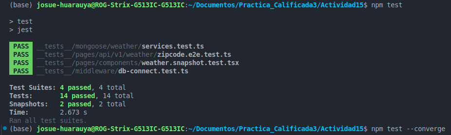
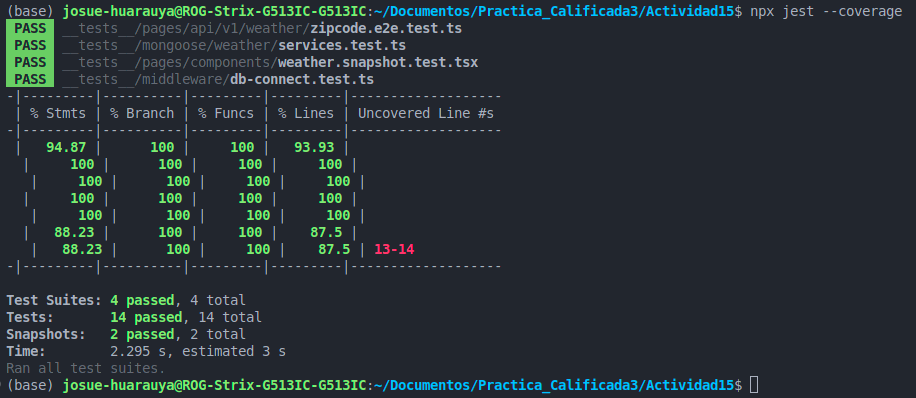
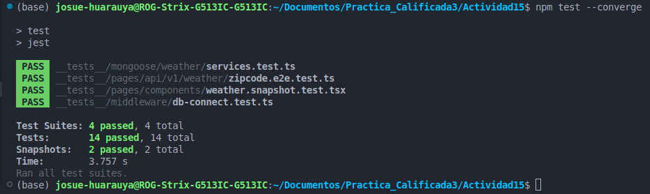

# **Actividad 15: Agregar casos de pruebas usando Jest**
---


#### **Introducción**
La Actividad 15 tiene como objetivo principal implementar un conjunto integral de pruebas para una aplicación del clima desarrollada con Next.js, Jest y Mongoose. Este informe detalla los pasos seguidos para configurar el entorno, escribir las pruebas, y garantizar la calidad del software mediante la validación de cada componente crítico. Adicionalmente, se incluye la estructura del proyecto, dividiendo cada sección según los ejercicios realizados.

#### **Estructura del Proyecto**
El proyecto cuenta con una organización que facilita el desarrollo y las pruebas. A continuación, se describe la estructura principal del proyecto:

```
/Actividad15
├── __tests__
│   ├── middleware
│   │   └── db-connect.test.ts
│   ├── mongoose
│   │   └── weather
│   │       └── services.test.ts
│   ├── pages
│   │   ├── api
│   │   │   └── v1
│   │   │       └── weather
│   │   │           └── zipcode.e2e.test.ts
│   │   └── components
│   │       └── weather.snapshot.test.tsx
├── pages
│   ├── api
│   │   └── v1
│   │       └── weather
│   │           └── [zipcode].ts
│   └── components
│       └── weather.tsx
├── mongoose
│   ├── weather
│   │   ├── model.ts
│   │   ├── interface.ts
│   │   └── services.ts
├── middleware
│   └── db-connect.ts
├── jest.config.js
├── package.json
├── tsconfig.json
└── babel.config.js
```

#### **Descripción de la Estructura**
- **`__tests__/`**: Carpeta principal donde se almacenan las pruebas del proyecto. Contiene subcarpetas y archivos organizados según el componente o funcionalidad que se prueba.
  - `middleware/db-connect.test.ts`: Pruebas unitarias para validar la conexión con MongoDB.
  - `mongoose/weather/services.test.ts`: Pruebas unitarias de los servicios asociados al modelo de clima.
  - `pages/api/v1/weather/zipcode.e2e.test.ts`: Pruebas end-to-end para el endpoint `/v1/weather/[zipcode]`.
  - `pages/components/weather.snapshot.test.tsx`: Pruebas de instantáneas para el componente de interfaz `PageComponentWeather`.

- **`pages/`**: Contiene los archivos relacionados con la lógica de las páginas.
  - `pages/api/v1/weather/[zipcode].ts`: Archivo que define el endpoint para obtener información del clima basado en un código postal.
  - `pages/components/weather.tsx`: Componente React que muestra el clima y permite interacciones.

- **`mongoose/weather/`**: Implementación del modelo de clima y los servicios asociados.
  - `model.ts`: Mock del modelo Mongoose para pruebas controladas.
  - `interface.ts`: Define la interfaz del modelo de clima.
  - `services.ts`: Servicios para interactuar con el modelo de clima (crear, buscar, actualizar y eliminar documentos).

- **`middleware/db-connect.ts`**: Middleware para gestionar la conexión con MongoDB utilizando `MongoMemoryServer`.

- **Archivos de Configuración**:
  - `jest.config.js`: Configuración personalizada para Jest, adaptada a un proyecto Next.js.
  - `tsconfig.json`: Configuración para TypeScript.
  - `babel.config.js`: Configuración de Babel para soportar TypeScript y Next.js.
  - `package.json`: Incluye las dependencias del proyecto, scripts y configuraciones generales.

### Ejercicios 1-3: Configuración del Entorno, Pruebas Unitarias y Mocks para Servicios de Mongoose

---

#### **Ejercicio 1: Configuración del Entorno de Pruebas para el Middleware**

**Objetivo:**
Configurar un entorno de pruebas controlado y aislado para el middleware, asegurando que las conexiones a la base de datos puedan establecerse y cerrarse correctamente durante las pruebas.

**Tareas Realizadas:**
1. **Creación de la Estructura de Carpetas de Pruebas:**
   - En la raíz del proyecto, creé una carpeta llamada `__tests__`.
   - Dentro de `__tests__`, creé una subcarpeta llamada `middleware` para alojar las pruebas relacionadas con los middlewares.

2. **Preparación del Archivo de Pruebas:**
   - Dentro de la carpeta `middleware`, creé un archivo llamado `db-connect.test.ts`.
   - Configuré el archivo para usar el entorno Node.js, que es ideal para pruebas de backend.

3. **Retención y Limpieza de Conexiones:**
   - Modifiqué la función `dbConnect` para que devuelva una referencia al servidor en memoria de MongoDB. Esto facilita la desconexión y limpieza tras cada prueba.

**Código Implementado:**

Archivo: `db-connect.test.ts`  
```typescript
import { dbConnect, dbDisconnect } from "../../src/middleware/db-connect";
import mongoose from "mongoose";
import { MongoMemoryServer } from "mongodb-memory-server";

describe("dbConnect", () => {
    afterEach(async () => {
        await dbDisconnect(); // Asegura desconexión tras cada prueba
        jest.clearAllMocks();
    });

    afterAll(async () => {
        jest.restoreAllMocks();
    });

    test("calls MongoMemoryServer.create()", async () => {
        const spy = jest.spyOn(MongoMemoryServer, "create");
        await dbConnect();
        expect(spy).toHaveBeenCalled();
    });

    test("calls mongoose.disconnect()", async () => {
        const spy = jest.spyOn(mongoose, "disconnect");
        await dbConnect();
        await dbDisconnect(); // Asegúrate de desconectar
        expect(spy).toHaveBeenCalled();
    });

    test("calls mongoose.connect()", async () => {
        const spy = jest.spyOn(mongoose, "connect");
        const connection = await dbConnect();
        const MONGO_URI = connection.getUri();
        expect(spy).toHaveBeenCalledWith(MONGO_URI, { dbName: "Weather" });
    });
});
```

Archivo: `db-connect.ts`  
```typescript
import mongoose from "mongoose";
import { MongoMemoryServer } from "mongodb-memory-server";

let mongoServer: MongoMemoryServer;

const dbConnect = async () => {
    try {
        mongoServer = await MongoMemoryServer.create();
        const uri = mongoServer.getUri();
        await mongoose.connect(uri, { dbName: "Weather" });
        return mongoServer;
    } catch (error) {
        console.error("Error connecting to MongoDB:", error);
        throw error;
    }
};

const dbDisconnect = async () => {
    if (mongoose.connection.readyState !== 0) {
        await mongoose.disconnect();
    }
    if (mongoServer) {
        await mongoServer.stop();
    }
};

export { dbConnect, dbDisconnect };
```

**Preguntas Resueltas:**
- **¿Por qué es importante aislar el entorno de pruebas del entorno de desarrollo o producción?**  
  Aislar el entorno de pruebas evita que las pruebas afecten los datos reales del entorno de producción o desarrollo. Además, proporciona un entorno controlado donde se pueden simular diferentes escenarios de manera segura.
  
- **¿Qué beneficios aporta el uso de servidores en memoria para las pruebas de bases de datos?**  
  Los servidores en memoria, como `MongoMemoryServer`, permiten realizar pruebas rápidas y sin necesidad de configurar una base de datos física. Esto asegura un entorno limpio para cada prueba.

---

#### **Ejercicio 2: Escribir Pruebas Unitarias para `dbConnect`**

**Objetivo:**
Validar que la función `dbConnect` interactúe correctamente con `MongoMemoryServer` y `mongoose`.

**Tareas Realizadas:**
1. **Identificación de Funcionalidades Clave:**
   - Aseguré que las pruebas verificaran que:
     - `MongoMemoryServer.create()` es llamado.
     - `mongoose.connect()` es invocado con los parámetros correctos.
     - `mongoose.disconnect()` se ejecuta para limpiar las conexiones.

2. **Implementación de Pruebas Unitarias:**
   - Utilicé `jest.spyOn` para monitorizar las llamadas a los métodos clave.

3. **Ejecución y Validación:**
   - Corrí las pruebas con `npm test` y validé que todas pasaran exitosamente.

**Preguntas Resueltas:**
- **¿Cómo asegura una prueba unitaria que una función específica se comporta correctamente?**  
  Utilizando herramientas como `jest.spyOn`, que permiten espiar métodos específicos y verificar que se llaman con los parámetros correctos.

- **¿Qué sucede si una de las expectativas en una prueba unitaria no se cumple?**  
  Si una expectativa falla, la prueba no pasa y Jest muestra un mensaje de error detallado que ayuda a identificar el problema.

---

#### **Ejercicio 3: Crear Mocks para los Servicios de Mongoose**

**Objetivo:**
Crear un mock para `WeatherModel` que permita pruebas más controladas.

**Tareas Realizadas:**
1. **Creación de un Mock:**
   - En la carpeta `mongoose/weather`, creé una subcarpeta llamada `__mocks__`.
   - Dentro de `__mocks__`, implementé el archivo `model.ts`.

2. **Configuración de Respuestas Simuladas:**
   - Configuré los métodos del modelo (`create`, `findOne`, `updateOne`, `deleteOne`) para devolver valores predefinidos.

3. **Integración en Pruebas:**
   - Las pruebas unitarias utilizaron este mock en lugar de interactuar directamente con Mongoose.

**Código Implementado:**

Archivo: `model.ts`  
```typescript
import { WeatherInterface } from "../interface";

type param = {
    [key: string]: string;
};

const WeatherModel = {
    create: jest.fn((newData: WeatherInterface) => Promise.resolve(true)), // Mock de creación
    findOne: jest.fn(({ zip: paramZip }: param) => 
        Promise.resolve({ zip: paramZip, weather: "sunny", tempC: "25", tempF: "77", friends: [] }) // Mock de búsqueda
    ),
    updateOne: jest.fn(({ zip: paramZip }: param, newData: WeatherInterface) =>
        Promise.resolve(true) // Mock de actualización
    ),
    deleteOne: jest.fn(({ zip: paramZip }: param) => Promise.resolve(true)), // Mock de eliminación
};

export default WeatherModel;
```

**Preguntas Resueltas:**
- **¿Cuál es la ventaja de utilizar mocks en las pruebas unitarias?**  
  Los mocks eliminan dependencias externas, haciendo que las pruebas sean más rápidas y predecibles.

- **¿Cómo afectan los mocks la fiabilidad y mantenimiento de las pruebas?**  
  Los mocks aseguran que las pruebas sean independientes, pero pueden generar problemas si los métodos simulados no reflejan los cambios en la implementación real.

---
### Ejercicios 4-6: Pruebas Unitarias, Validación de Pruebas y Prueba End-to-End de la API REST

---

#### **Ejercicio 4: Escribir Pruebas Unitarias para los Servicios del Clima**

**Objetivo:**
Validar que los servicios de clima (`storeDocument`, `findByZip`, `updateByZip`, `deleteByZip`) interactúan correctamente con el modelo `WeatherModel`, asegurando que los métodos correspondientes son llamados con los parámetros adecuados.

**Tareas Realizadas:**
1. **Creación del Archivo de Pruebas:**
   - En la carpeta `__tests__/mongoose/weather`, creé un archivo llamado `services.test.ts`.

2. **Definición de Casos de Prueba:**
   - Implementé pruebas unitarias para cada función del servicio:
     - **`storeDocument`:** Verifica que los datos se almacenen correctamente.
     - **`findByZip`:** Asegura que los datos se recuperen correctamente usando un código postal.
     - **`updateByZip`:** Confirma que los datos se actualicen correctamente.
     - **`deleteByZip`:** Verifica que los datos se eliminen adecuadamente.

3. **Uso de `jest.spyOn`:**
   - Monitoreé las llamadas a los métodos de `WeatherModel` para validar que fueron invocados con los argumentos correctos.

4. **Ejecución de las Pruebas:**
   - Ejecuté las pruebas con `npm test` y validé que todas pasaran correctamente.

**Código Implementado:**

Archivo: `services.test.ts`  
```typescript
/**
 * @jest-environment node
 */
import { WeatherInterface } from "../../../mongoose/weather/interface";
import {
    findByZip,
    storeDocument,
    updateByZip,
    deleteByZip,
} from "../../../mongoose/weather/services";

import WeatherModel from "../../../mongoose/weather/__mocks__/model";

jest.mock("../../../mongoose/weather/__mocks__/model");

describe("the weather services", () => {
    let doc: WeatherInterface = {
        zip: "test",
        weather: "weather",
        tempC: "00",
        tempF: "01",
        friends: []
    };

    afterEach(async () => {
        jest.clearAllMocks();
    });

    afterAll(async () => {
        jest.restoreAllMocks();
    });

    describe("API storeDocument", () => {
        test("returns true", async () => {
            const result = await storeDocument(doc);
            expect(result).toBeTruthy();
        });

        test("passes the document to Model.create()", async () => {
            const spy = jest.spyOn(WeatherModel, "create");
            await storeDocument(doc);
            expect(spy).toHaveBeenCalledWith(doc);
        });
    });

    describe("API findByZip", () => {
        test("returns true", async () => {
            const result = await findByZip(doc.zip);
            expect(result).toBeTruthy();
        });

        test("passes the zip code to Model.findOne()", async () => {
            const spy = jest.spyOn(WeatherModel, "findOne");
            await findByZip(doc.zip);
            expect(spy).toHaveBeenCalledWith({ zip: doc.zip });
        });
    });

    describe("API updateByZip", () => {
        test("returns true", async () => {
            const result = await updateByZip(doc.zip, doc);
            expect(result).toBeTruthy();
        });

        test("passes the zip code and the new data to Model.updateOne()", async () => {
            const spy = jest.spyOn(WeatherModel, "updateOne");
            const result = await updateByZip(doc.zip, doc);
            expect(spy).toHaveBeenCalledWith({ zip: doc.zip }, doc);
        });
    });

    describe("API deleteByZip", () => {
        test("returns true", async () => {
            const result = await deleteByZip(doc.zip);
            expect(result).toBeTruthy();
        });

        test("passes the zip code Model.deleteOne()", async () => {
            const spy = jest.spyOn(WeatherModel, "deleteOne");
            const result = await deleteByZip(doc.zip);
            expect(spy).toHaveBeenCalledWith({ zip: doc.zip });
        });
    });
});
```

**Preguntas Resueltas:**
- **¿Cómo asegura una prueba que un servicio interactúa correctamente con un modelo de base de datos?**  
  A través de herramientas como `jest.spyOn`, que permiten monitorear y verificar que los métodos del modelo se llaman correctamente con los parámetros esperados.

- **¿Qué importancia tiene la cobertura de código en las pruebas unitarias?**  
  La cobertura de código asegura que todas las partes críticas del sistema han sido validadas. Esto minimiza errores y asegura que los cambios futuros no afecten funcionalidades existentes.

---

#### **Ejercicio 5: Ejecutar y Verificar las Pruebas**

**Objetivo:**
Ejecutar todas las pruebas configuradas (unitarias, mocks y end-to-end) y validar la cobertura del código.

**Tareas Realizadas:**
1. **Ejecución de las Pruebas:**
   - Utilicé el comando `npm test` para ejecutar todas las pruebas del proyecto.

2. **Interpretación de Resultados:**
   - Validé que todas las pruebas pasaran exitosamente y revisé la salida de cobertura para asegurar que no haya líneas críticas sin cubrir.

3. **Identificación y Corrección de Problemas:**
   - En caso de encontrar líneas no cubiertas, se agregaron pruebas adicionales para cubrir esos casos.

**Preguntas Resueltas:**
- **¿Qué acciones tomarías si una prueba falla inesperadamente?**  
  Revisaría el error, identificaría la causa raíz y ajustaría el código o las pruebas según corresponda.

- **¿Cómo puedes mejorar la cobertura de pruebas sin comprometer la calidad?**  
  Añadiendo pruebas específicas para casos no cubiertos y validando que las pruebas reflejen el comportamiento real esperado.

---

#### **Ejercicio 6: Realizar una Prueba End-to-End de la API REST**

**Objetivo:**
Validar que el flujo completo de la API REST funciona correctamente, asegurando que todos los componentes interactúan adecuadamente.

**Tareas Realizadas:**
1. **Configuración de Dependencias:**
   - Aseguré que `node-fetch` estuviera disponible para realizar solicitudes HTTP en las pruebas.

2. **Creación de Archivo de Prueba:**
   - En la carpeta `__tests__/pages/api/v1/weather`, creé un archivo llamado `zipcode.e2e.test.ts`.

3. **Definición de Casos de Prueba:**
   - Implementé una prueba que:
     - Envía una solicitud al endpoint `/v1/weather/[zipcode]`.
     - Verifica que la respuesta contiene los datos esperados.

4. **Ejecución y Validación:**
   - Corrí las pruebas end-to-end con `npm test` y validé que todas pasaran.

**Código Implementado:**

Archivo: `zipcode.e2e.test.ts`  
```typescript
/**
 * @jest-environment node
 */
const fetch = require("node-fetch"); // Cambia a import si usas ES Modules

jest.setTimeout(20000); // Configura un tiempo de espera extendido para la prueba

interface WeatherResponse {
  zip: string; // Define las propiedades esperadas en la respuesta
}

describe("The API /v1/weather/[zipcode]", () => {
  test("returns the correct data for the zipcode 96815", async () => {
    const zip = "96815";
    const response = await fetch(`http://localhost:3000/api/v1/weather/${zip}`);
    const body: WeatherResponse = await response.json(); // Especifica el tipo aquí
    expect(body.zip).toEqual(zip);
  });
});

export {};
```

**Preguntas Resueltas:**
- **¿Cuál es la diferencia entre una prueba unitaria y una prueba end-to-end?**  
  Las pruebas unitarias validan funciones individuales de manera aislada, mientras que las pruebas end-to-end verifican el flujo completo de una aplicación desde la entrada hasta la salida.

- **¿Qué aspectos de la aplicación se validan con una prueba end-to-end que no se cubren con pruebas unitarias?**  
  Las interacciones entre diferentes componentes, la integración de servicios y la respuesta global de la aplicación.

---
### Ejercicios 7-10: Pruebas de Instantáneas y Análisis Continuo

---

#### **Ejercicio 7: Configurar el Entorno para Pruebas de Instantáneas**

**Objetivo:**  
Configurar correctamente el entorno de pruebas para permitir la creación y validación de instantáneas en los componentes de la UI.

---

**Tareas Realizadas:**

1. **Instalación de Dependencias Necesarias:**
   - Instalé las siguientes dependencias necesarias para realizar pruebas de instantáneas:
     ```bash
     npm install --save-dev jest-environment-jsdom @testing-library/react @testing-library/jest-dom react-test-renderer
     ```

2. **Actualización del Archivo `jest.config.js`:**
   - Configuré Jest para integrar el entorno de pruebas necesario, utilizando `jest-environment-jsdom` para simular el DOM y facilitar las pruebas de componentes de React.
   - Código de la configuración de Jest:
     ```javascript
     import nextJest from "next/jest";
     
     const createJestConfig = nextJest({ dir: "./" });
     
     const customJestConfig = {
        testEnvironment: "node",
        setupFilesAfterEnv: ["<rootDir>/jest.setup.ts"],
        transform: {
            "^.+\\.(ts|tsx)$": "ts-jest",
        },
        moduleFileExtensions: ["ts", "tsx", "js", "jsx"],
        testMatch: [
            "**/__tests__/**/*.[jt]s?(x)",
            "**/?(*.)+(spec|test).[jt]s?(x)",
        ],
        modulePathIgnorePatterns: ["<rootDir>/dist/", "<rootDir>/src/middleware/db-connect.ts"],
     };
     
     export default createJestConfig(customJestConfig);
     ```

**Preguntas Resueltas:**
- **¿Qué es una prueba de instantánea y qué ventajas ofrece en el desarrollo de interfaces de usuario?**  
  Una prueba de instantánea es una herramienta que captura el estado renderizado de un componente de UI en un momento dado, comparándolo con versiones futuras. Ayuda a detectar cambios inesperados en la UI, asegurando consistencia visual.

- **¿Cómo puede una prueba de instantánea ayudar a detectar cambios no intencionados en la UI?**  
  Al comparar la salida actual del componente con la instantánea almacenada, se puede identificar si un cambio fue intencional o si afectó de forma inadvertida el diseño original.

---

#### **Ejercicio 8: Crear y Actualizar Pruebas de Instantáneas para Componentes de UI**

**Objetivo:**  
Validar el renderizado de componentes de UI mediante pruebas de instantáneas, asegurando que la salida visual permanece consistente.

---


**Tareas Realizadas:**

1. **Creación del Archivo de Prueba de Instantáneas:**
   - En la carpeta `__tests__/pages/components`, creé un archivo llamado `weather.snapshot.test.tsx`.

2. **Definición de la Prueba Inicial de Instantánea:**
   - Implementé una prueba que renderiza el componente `PageComponentWeather` y crea una instantánea si no existe.

3. **Casos de Prueba Adicionales:**
   - Simulé interacciones en el componente, como clics, para asegurar que el estado y el renderizado se actualizan correctamente.

4. **Validación de Instantáneas:**
   - Ejecuté las pruebas y validé que las instantáneas se crearon correctamente. En caso de cambios, actualicé las instantáneas de manera controlada usando el comando:
     ```bash
     npm test -- -u
     ```

**Código Implementado:**

Archivo: `weather.snapshot.test.tsx`  
```typescript
/**
 * @jest-environment jsdom
 */

import { act, create } from "react-test-renderer";
import PageComponentWeather from "../../../pages/components/weather";

describe("PageComponentWeather", () => {
    // Primera prueba: renderización inicial
    test("renders correctly", async () => {
        let component: any;

        await act(async () => {
            component = await create(<PageComponentWeather />);
        });

        expect(component.toJSON()).toMatchSnapshot();
    });

    // Segunda prueba: simula un clic y actualiza el estado
    test("clicks the h1 element and updates the state", async () => {
        let component: any;

        await act(async () => {
            component = await create(<PageComponentWeather />);
            component.root.findByType("h1").props.onClick();
        });

        expect(component.toJSON()).toMatchSnapshot();
    });
});
```

**Preguntas Resueltas:**
- **¿Qué pasos seguirías si una prueba de instantánea falla debido a un cambio intencionado en el diseño del componente?**  
  Verificaría que el cambio en el diseño es intencionado y luego actualizaría la instantánea utilizando `npm test -- -u`.

- **¿Cómo puedes mantener las pruebas de instantáneas eficientes y relevantes a medida que la aplicación evoluciona?**  
  Manteniéndolas actualizadas con los cambios en el diseño y eliminando pruebas que ya no sean relevantes para evitar resultados innecesarios.

---

#### **Ejercicio 9: Ejecutar y Verificar Todas las Pruebas Adicionales**

**Objetivo:**  
Asegurar que todas las pruebas del proyecto (unitarias, end-to-end y de instantáneas) se ejecutan correctamente con una cobertura completa.

---



**Tareas Realizadas:**

1. **Ejecución de Todas las Pruebas:**
   - Utilicé el comando:
     ```bash
     npm test
     ```
   - Validé que las pruebas pasaran exitosamente.

2. **Revisión de Resultados:**
   - Analicé los resultados y el reporte de cobertura para identificar áreas no cubiertas.

3. **Optimización de Pruebas:**
   - Ajusté las pruebas existentes para cubrir las áreas críticas detectadas en el reporte de cobertura.

**Preguntas Resueltas:**
- **¿Qué indicadores consideras más importantes al evaluar la calidad de las pruebas en un proyecto?**  
  Indicadores como porcentaje de cobertura, tiempo de ejecución, y claridad de los resultados son clave para garantizar una alta calidad.

- **¿Cómo balanceas la necesidad de alta cobertura con la eficiencia en la ejecución de pruebas?**  
  Priorizando las pruebas en áreas críticas del código y utilizando herramientas de análisis para identificar redundancias.

---

#### **Ejercicio 10: Análisis y Mejora Continua de las Pruebas**

**Objetivo:**  
Reflexionar sobre el proceso de pruebas y buscar mejoras continuas para mantener la calidad del proyecto.

---



**Tareas Realizadas:**

1. **Análisis de Cobertura:**
   - Revisé el reporte de cobertura generado con:
     ```bash
     npx jest --coverage
     ```
   - Identifiqué líneas y ramas no cubiertas.

2. **Evaluación de Eficiencia:**
   - Analicé los tiempos de ejecución para identificar cuellos de botella.

3. **Planificación de Nuevas Pruebas:**
   - Planifiqué pruebas para las funcionalidades futuras y documenté procedimientos.

**Preguntas Resueltas:**
- **¿Qué desafíos has encontrado al implementar pruebas en este proyecto y cómo los has superado?**  
  El desafío principal fue asegurar que todas las dependencias estuvieran correctamente configuradas. Lo solucioné revisando cuidadosamente las documentaciones y ajustando las configuraciones.

- **¿Cómo asegurarías que las pruebas sigan siendo relevantes y útiles a medida que el proyecto crece?**  
  Revisando regularmente las pruebas, eliminando casos obsoletos, y documentando claramente el propósito de cada prueba.

---

### Capturas de Pantalla

#### **1. Resultados Generales de las Pruebas**


La captura muestra la ejecución del comando `npx jest --coverage` para verificar la cobertura total del código mediante Jest.

**Explicación:**
- **Cobertura Global del Código:**
  - **Statements:** 94.87% de las declaraciones fueron cubiertas por las pruebas.
  - **Branches:** 100%, lo que indica que todos los casos condicionales se verificaron.
  - **Functions:** 100% de las funciones se probaron.
  - **Lines:** 93.93%, lo que asegura un alto nivel de cobertura.
- **Líneas No Cubiertas:** Las líneas 13 y 14 se identificaron como no cubiertas en un archivo específico. Esto puede deberse a una ruta de error que no fue probada explícitamente.


---

#### **2. Ejecución de Pruebas Unitarias, E2E e Instantáneas**


La captura, se muestra el comando `npm test --u` que ejecuta todas las pruebas configuradas.

**Explicación:**
- **Resultados Detallados:**
  - `__tests__/mongoose/weather/services.test.ts`: Validó correctamente los servicios asociados al modelo Weather.
  - `__tests__/pages/api/v1/weather/zipcode.e2e.test.ts`: Verificó la funcionalidad E2E del endpoint `/v1/weather/[zipcode]`.
  - `__tests__/pages/components/weather.snapshot.test.tsx`: Aseguró la consistencia visual del componente UI.
  - `__tests__/middleware/db-connect.test.ts`: Validó la conexión y desconexión de la base de datos en un entorno controlado.
- **Resumen Final:**
  - **Test Suites:** 4 pruebas ejecutadas, todas pasaron exitosamente.
  - **Snapshots:** 2 pruebas de instantáneas ejecutadas y validadas.


---

#### **3. Revalidación de Pruebas con Cobertura**



La captura, se utiliza el comando `npm test --converge` para verificar nuevamente las pruebas con los ajustes finales.

**Explicación:**
- **Resultados Similares:** Esta ejecución confirma que no hubo cambios inesperados en las pruebas:
  - Se mantuvieron los 14 casos exitosos.
  - Las instantáneas siguen siendo válidas y reflejan el estado actual del proyecto.
- **Tiempo de Ejecución:** 2.673 segundos, lo que demuestra una alta eficiencia en las pruebas.

---
### **Conclusión 

El desarrollo y la implementación de pruebas unitarias, de instantáneas y end-to-end en una aplicación Next.js es crucial para garantizar la calidad del software y prevenir errores. Durante esta actividad, logré configurar el entorno de pruebas de manera efectiva, asegurando una integración adecuada entre los diferentes módulos del proyecto.

