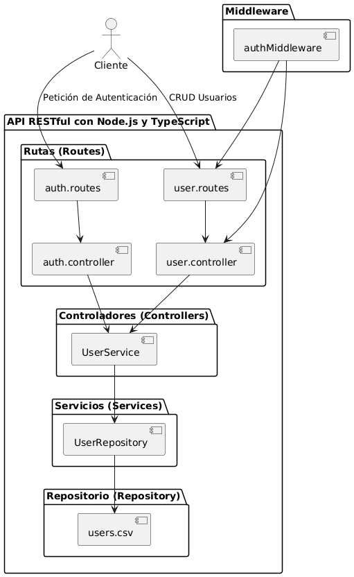
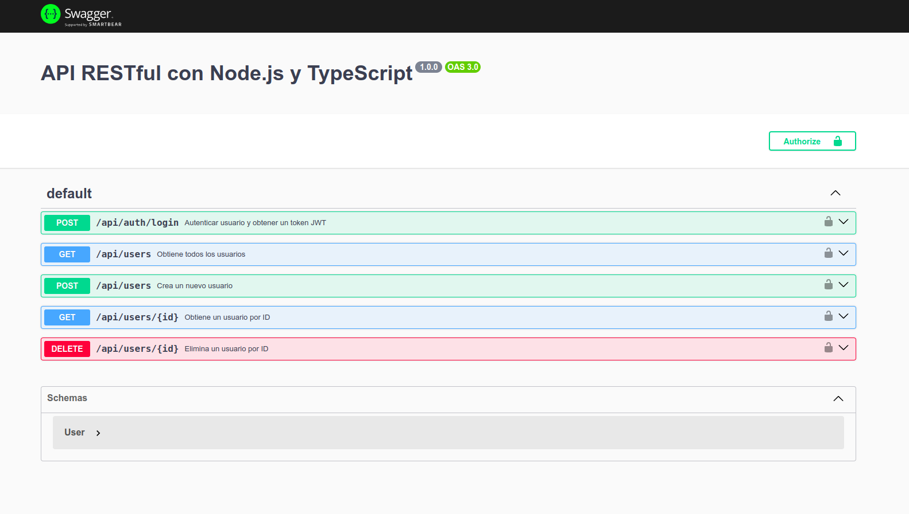

# Documentación del Proyecto: API RESTful con Node.js y TypeScript

## Descripción del Proyecto

Este proyecto consiste en la implementación de una API RESTful utilizando Node.js y TypeScript, con el objetivo de gestionar información de usuarios mediante peticiones HTTP. El proyecto sigue el patrón de arquitectura MVC (Modelo, Vista, Controlador) para mantener una separación clara entre la lógica de negocio, la gestión de datos y las rutas de la API.

## Arquitectura General del Proyecto

La arquitectura del proyecto se basa en los siguientes componentes:

- **Modelo (Models)**: Define la estructura de los datos del usuario, es decir, los atributos que cada usuario tiene, como `id`, `name`, `email` y `password`.
- **Repositorio (Repository)**: Se encarga del acceso a los datos. En este caso, el repositorio carga los usuarios desde un archivo CSV y proporciona métodos para buscar, crear y eliminar usuarios.
- **Servicio (Service)**: Contiene la lógica de negocio. A través del servicio se gestionan las operaciones con los usuarios, como obtener todos los usuarios, crear uno nuevo, o eliminar un usuario existente.
- **Controlador (Controller)**: Recibe las peticiones HTTP, se comunica con los servicios y devuelve la respuesta adecuada. Por ejemplo, el controlador tiene métodos para manejar peticiones GET, POST, DELETE, etc.
- **Rutas (Routes)**: Define los endpoints disponibles para la API. Cada ruta está asociada a un controlador específico y, si es necesario, tiene middleware de autenticación para proteger ciertos endpoints.
- **Middleware (Middleware)**: Se utiliza para manejar la autenticación mediante JWT, validando cada solicitud antes de permitir el acceso a ciertos endpoints protegidos.

El proyecto incluye una documentación automática de la API usando **Swagger**, que permite a los desarrolladores explorar y probar los endpoints de manera fácil e interactiva.

## Lógica de Conexión de Archivos

El flujo de la aplicación sigue la arquitectura MVC, donde cada archivo tiene una responsabilidad clara:

1. **Modelos (models)**: Define la estructura de los objetos de datos. En este caso, el modelo `User` define las propiedades de un usuario.
2. **Repositorio (repositories)**: Los repositorios se encargan de la interacción directa con los datos. El `UserRepository` carga los datos desde un archivo CSV y proporciona métodos para manipularlos.
3. **Servicios (services)**: Los servicios (`UserService`) contienen la lógica de negocio y operan sobre los datos usando el repositorio. Aquí es donde se implementan las reglas para crear, actualizar o eliminar usuarios.
4. **Controladores (controllers)**: Los controladores (`user.controller.ts` y `auth.controller.ts`) se encargan de recibir las peticiones del cliente, interactuar con los servicios y devolver respuestas. Cada controlador corresponde a diferentes endpoints.
5. **Rutas (routes)**: Las rutas (`user.routes.ts` y `auth.routes.ts`) definen los endpoints disponibles para la API y mapean cada endpoint a un controlador específico.
6. **Middleware (middlewares)**: El `authMiddleware` maneja la autenticación, verificando los tokens JWT para proteger los endpoints sensibles.

### Diagrama de la Arquitectura

*A continuación, se debe insertar un diagrama que muestre la conexión entre los diferentes componentes de la aplicación: `Models`, `Repositories`, `Services`, `Controllers`, `Routes`, y `Middleware`.*



## Imagen del Swagger

La siguiente imagen muestra la documentación de la API generada por Swagger, con los endpoints disponibles:



## Dependencias del Proyecto e Instalación

Para poner en marcha este proyecto desde cero, es necesario instalar algunas dependencias y herramientas. A continuación, se describe cómo instalarlas y ejecutar la API.

### Instalación de Dependencias

Una vez tengas Node.js instalado, debes clonar este repositorio en tu sistema y navegar al directorio del proyecto. Después, ejecuta el siguiente comando para instalar todas las dependencias necesarias:

```bash
npm install
```

Las principales dependencias de este proyecto son:

- **Express**: Framework para crear el servidor y manejar las peticiones HTTP.
- **Swagger-ui-express** y **swagger-jsdoc**: Utilizadas para documentar la API.
- **Jsonwebtoken**: Utilizado para la autenticación mediante tokens JWT.
- **Csv-parser**: Librería para leer los datos de usuarios almacenados en un archivo CSV.
- **Jest** y **Supertest**: Utilizados para las pruebas unitarias e integración.

Para instalar cada una de estas dependencias, se utiliza `npm install` seguido del nombre de la dependencia. Ejemplo:

```bash
npm install express
npm install swagger-ui-express swagger-jsdoc
npm install jsonwebtoken
npm install csv-parser
npm install jest supertest
```

### Ejecución del Proyecto

Para ejecutar el proyecto en modo desarrollo, utiliza el siguiente comando:

```bash
npx tsc && node dist/app/index.js
```

Este comando primero compila el proyecto TypeScript usando `tsc` y luego ejecuta la versión JavaScript que se encuentra en el directorio `dist`.

### Acceso a la Documentación Swagger

Una vez que el servidor está corriendo, puedes acceder a la documentación Swagger abriendo el siguiente enlace en tu navegador:

[http://localhost:3000/api-docs/#/](http://localhost:3000/api-docs/#/)

Allí podrás visualizar todos los endpoints disponibles, así como sus respectivos parámetros, respuestas, y ejemplos de cómo realizar las peticiones.

## Uso de la API

La API ofrece varios endpoints para interactuar con los usuarios:

- **POST /api/auth/login**: Autenticar un usuario y obtener un token JWT.
- **GET /api/users**: Obtener todos los usuarios (requiere autenticación).
- **POST /api/users**: Crear un nuevo usuario (requiere autenticación).
- **GET /api/users/{id}**: Obtener un usuario por ID (requiere autenticación).
- **DELETE /api/users/{id}**: Eliminar un usuario por ID (requiere autenticación).

## Pruebas

El proyecto incluye pruebas unitarias e integración para asegurar la correcta funcionalidad de la API. Las pruebas se encuentran en la carpeta `/tests` y se pueden ejecutar con el siguiente comando:

```bash
npm test
```

Esto ejecutará todas las pruebas escritas con Jest y Supertest, incluyendo pruebas para el middleware de autenticación y para cada uno de los endpoints de la API.

