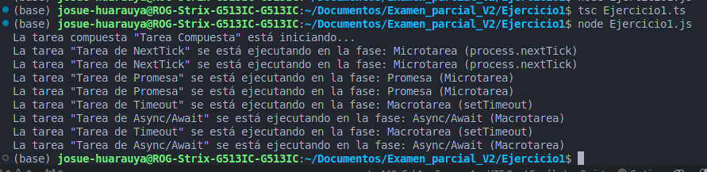

## Ejercicio 1: Simulación del Event Loop en Node.js con TypeScript

### Descripción del Problema
Se requiere desarrollar un script en TypeScript que simule y demuestre detalladamente el funcionamiento de las fases del Event Loop en Node.js, incluyendo el manejo de microtareas y macrotareas. El objetivo es ilustrar cómo las tareas se encolan y ejecutan en las diferentes fases, y cómo las microtareas tienen prioridad sobre las macrotareas.

### Solución Implementada
Se implementó una solución que cumple con las siguientes características avanzadas de TypeScript:
- Tipos avanzados (tipos de unión e intersección).
- Utility types (`Pick`, `Readonly`).
- Interfaces y tipos de funciones.
- Generics para crear clases y funciones reutilizables.
- Programación Orientada a Objetos (POO) aplicando herencia, polimorfismo, abstracción y encapsulación.
- Manejo de `null` y `undefined` con narrowing.

### Código Fuente

```typescript
// Definición de interfaces y clases base para tareas
interface Task {
  name: string;
  execute(): void;
}

// Clase abstracta para encapsular lógica común
abstract class BaseTask implements Task {
  constructor(public name: string) {}

  // Método abstracto que se implementará en clases derivadas
  abstract execute(): void;

  // Método protegido para registrar la fase en la consola
  protected logPhase(phase: string) {
    console.log(`La tarea "${this.name}" se está ejecutando en la fase: ${phase}`);
  }
}

// Macrotarea que se ejecutará en el Event Loop
class MacroTask extends BaseTask {
  execute() {
    // Usamos setTimeout para simular una macrotarea
    setTimeout(() => {
      this.logPhase("Macrotarea (setTimeout)");
    }, 0);
  }
}

// Microtarea que se ejecutará en la cola de microtareas
class MicroTask extends BaseTask {
  execute() {
    // Usamos process.nextTick para simular una microtarea
    process.nextTick(() => {
      this.logPhase("Microtarea (process.nextTick)");
    });
  }
}

// Tarea basada en Promesa para demostrar el uso de promesas
class PromiseTask extends BaseTask {
  execute() {
    // Resolvemos una promesa para ejecutar una microtarea
    Promise.resolve().then(() => {
      this.logPhase("Promesa (Microtarea)");
    });
  }
}

// Tarea asíncrona que usa async/await
class AsyncAwaitTask extends BaseTask {
  async execute() {
    // Usamos setTimeout dentro de una promesa para simular una operación asincrónica
    await new Promise((resolve) => setTimeout(resolve, 0));
    this.logPhase("Async/Await (Macrotarea)");
  }
}

// Ejemplo de uso de utility types de TypeScript
type ReadonlyTask = Readonly<Pick<Task, 'name'>>;

// Clase compuesta que demuestra polimorfismo y herencia
class CompositeTask extends BaseTask {
  private subTasks: Task[] = [];

  constructor(name: string, subTasks: Task[]) {
    super(name);
    this.subTasks = subTasks;
  }

  // Método que ejecuta todas las sub-tareas
  execute() {
    console.log(`La tarea compuesta "${this.name}" está iniciando...`);
    this.subTasks.forEach((task) => task.execute());
  }
}

// Función para demostrar el manejo de null y undefined con narrowing
function executeTask(task: Task | null | undefined) {
  if (task) {
    task.execute();
  } else {
    console.log("La tarea no está definida.");
  }
}

// Configuración de las tareas para simular el Event Loop
const tasks: Task[] = [
  new MacroTask("Tarea de Timeout"),
  new MicroTask("Tarea de NextTick"),
  new PromiseTask("Tarea de Promesa"),
  new AsyncAwaitTask("Tarea de Async/Await"),
];

// Ejecución de tareas individuales
tasks.forEach(executeTask);

// Ejemplo de tarea compuesta que demuestra polimorfismo
const compositeTask = new CompositeTask("Tarea Compuesta", tasks);
executeTask(compositeTask);
```

### Explicación de la Solución
- **Tipos Avanzados y Utility Types**: Usamos `Pick` y `Readonly` para definir tipos restringidos.
- **Clases e Interfaces**: Se utilizaron interfaces (`Task`) y clases abstractas (`BaseTask`) para encapsular la lógica de las tareas.
- **Manejo de Promesas y async/await**: Se implementaron tareas que utilizan Promesas (`PromiseTask`) y `async/await` (`AsyncAwaitTask`).
- **Diferentes fases del Event Loop**: Se demostraron las fases de macrotareas (`setTimeout`) y microtareas (`process.nextTick`).
- **Polimorfismo y Herencia**: La clase `CompositeTask` demuestra polimorfismo al manejar una colección de sub-tareas.
- **Narrowing para Manejo de null y undefined**: La función `executeTask` maneja la posibilidad de recibir valores nulos o indefinidos mediante narrowing.

### Resultados y Observaciones



El código se ejecuta de manera exitosa y demuestra cómo se comportan las microtareas y macrotareas en el Event Loop. Las tareas se imprimen en consola según la fase del Event Loop en la que se ejecutan, lo cual muestra la prioridad de las microtareas sobre las macrotareas.

