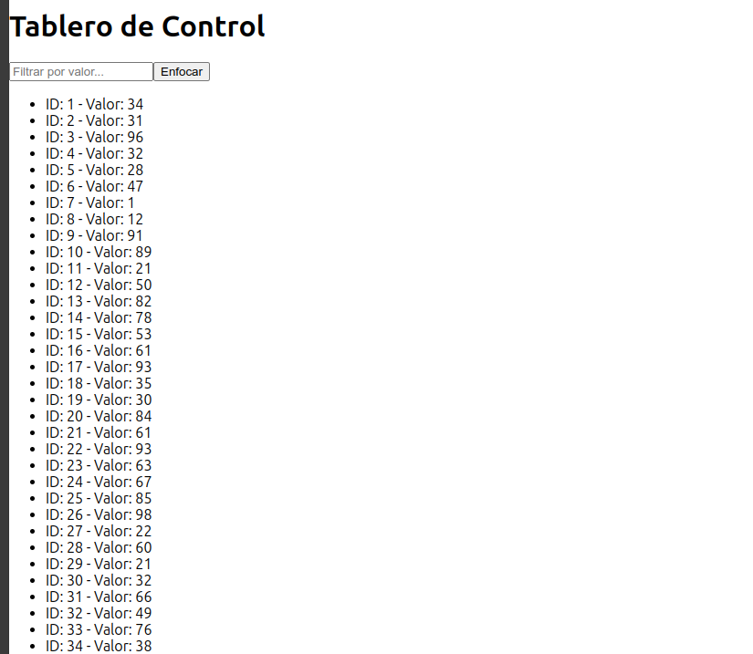

## Ejercicio 2: Aplicación React con Hooks Personalizados y Manejo del Estado

### Descripción del Problema

Crea una aplicación React funcional enfocándote en el manejo avanzado del estado y efectos colaterales utilizando Hooks. La aplicación debe simular un tablero de control en tiempo real que muestre datos actualizados cada cierto intervalo, permitiendo al usuario filtrar y manipular la información presentada.

### Solución Implementada

Se ha desarrollado una aplicación que utiliza Hooks avanzados de React (`useState`, `useEffect`, `useContext`, `useReducer`, `useMemo`, `useCallback`, `useRef`) y hooks personalizados para simular datos en tiempo real y permitir la manipulación de la información por parte del usuario.

### Código Fuente

El código fuente se encuentra en el archivo `App.tsx` ubicado en la carpeta `src` del proyecto.

```tsx
// Archivo: src/App.tsx
import React, { useState, useEffect, useContext, useReducer, useMemo, useCallback, useRef, createContext } from 'react';

// 1. Definición del contexto global y el estado inicial
interface GlobalState {
  data: Array<{ id: number, value: number }>;
  filter: string;
}

const initialState: GlobalState = {
  data: [],
  filter: ''
};

// Definimos acciones para el reducer
type Action = { type: 'SET_DATA', payload: Array<{ id: number, value: number }> } | { type: 'SET_FILTER', payload: string };

const globalReducer = (state: GlobalState, action: Action): GlobalState => {
  switch (action.type) {
    case 'SET_DATA':
      return { ...state, data: action.payload };
    case 'SET_FILTER':
      return { ...state, filter: action.payload };
    default:
      return state;
  }
};

// Creación del contexto global
const GlobalStateContext = createContext<{ state: GlobalState; dispatch: React.Dispatch<Action> }>({
  state: initialState,
  dispatch: () => undefined
});

// 2. Hook personalizado para simular datos en tiempo real
const useSimulatedData = (interval: number) => {
  const [data, setData] = useState<Array<{ id: number, value: number }>>([]);

  useEffect(() => {
    const intervalId = setInterval(() => {
      setData((prevData) => [
        ...prevData,
        { id: prevData.length + 1, value: Math.floor(Math.random() * 100) }
      ]);
    }, interval);

    return () => clearInterval(intervalId);
  }, [interval]);

  return data;
};

// 3. Proveedor del contexto global
const GlobalStateProvider: React.FC<{ children: React.ReactNode }> = ({ children }) => {
  const [state, dispatch] = useReducer(globalReducer, initialState);
  return <GlobalStateContext.Provider value={{ state, dispatch }}>{children}</GlobalStateContext.Provider>;
};

// 4. Componente principal Dashboard
const Dashboard: React.FC = () => {
  const { state, dispatch } = useContext(GlobalStateContext);
  const data = useSimulatedData(2000); // Simulación de datos cada 2 segundos

  // Actualizamos el estado global con los datos simulados
  useEffect(() => {
    dispatch({ type: 'SET_DATA', payload: data });
  }, [data, dispatch]);

  // Función para actualizar el filtro con `useCallback` y evitar recreaciones
  const updateFilter = useCallback((e: React.ChangeEvent<HTMLInputElement>) => {
    dispatch({ type: 'SET_FILTER', payload: e.target.value });
  }, [dispatch]);

  // Uso de `useMemo` para filtrar los datos y evitar cálculos innecesarios
  const filteredData = useMemo(() => {
    return state.data.filter((item) => item.value.toString().includes(state.filter));
  }, [state.data, state.filter]);

  // Referencia para un campo de entrada
  const inputRef = useRef<HTMLInputElement>(null);

  return (
    <div>
      <h1>Tablero de Control</h1>
      <input
        ref={inputRef}
        type="text"
        value={state.filter}
        onChange={updateFilter}
        placeholder="Filtrar por valor..."
      />
      <button onClick={() => inputRef.current?.focus()}>Enfocar</button>
      <ul>
        {filteredData.map((item) => (
          <li key={item.id}>{`ID: ${item.id} - Valor: ${item.value}`}</li>
        ))}
      </ul>
    </div>
  );
};

// 5. Componente de la aplicación principal
const App: React.FC = () => {
  return (
    <GlobalStateProvider>
      <Dashboard />
    </GlobalStateProvider>
  );
};

export default App;
```

### Explicación de la Solución

1. **Estado Global**: Utilizamos `useContext` y `useReducer` para gestionar un estado global que incluye los datos simulados y un filtro.
2. **Hook Personalizado**: Creamos `useSimulatedData` para generar datos aleatorios en intervalos definidos y devolverlos al componente.
3. **Optimización de Rendimiento**:
   - **`useMemo`**: Para calcular y memorizar los datos filtrados, evitando cálculos innecesarios.
   - **`useCallback`**: Para memorizar la función de actualización del filtro y evitar recreaciones innecesarias.
4. **Manipulación del DOM con `useRef`**: Se usa `useRef` para enfocar el campo de entrada cuando se hace clic en el botón.
5. **Interfaces y Tipos**: Usamos `interfaces` para definir el estado global y las acciones del reducer.

### Resultado Esperado



- La aplicación muestra un tablero de control con datos simulados que se actualizan automáticamente cada 2 segundos.
- Permite al usuario filtrar los datos y enfocar el campo de entrada.
- Responde a las interacciones del usuario y mantiene una estructura de estado centralizada.

### Instrucciones para Crear y Ejecutar la Aplicación

1. **Crear el Proyecto**:

   Ejecuta el siguiente comando para crear un nuevo proyecto de React con TypeScript utilizando Create React App:

   ```bash
   npx create-react-app ejercicio2 --template typescript
   ```

   Este comando creará un directorio llamado `ejercicio2` con la estructura de un proyecto de React.

2. **Navegar al Directorio del Proyecto**:

   ```bash
   cd ejercicio2
   ```

3. **Agregar el Código Fuente**:

   Reemplaza el contenido del archivo `src/App.tsx` con el código proporcionado.

4. **Instalar las Dependencias**:

   ```bash
   npm install
   ```

5. **Ejecutar la Aplicación**:

   ```bash
   npm start
   ```

6. **Acceder a la Aplicación**:

   La aplicación se ejecutará en el navegador en `http://localhost:3000`.
