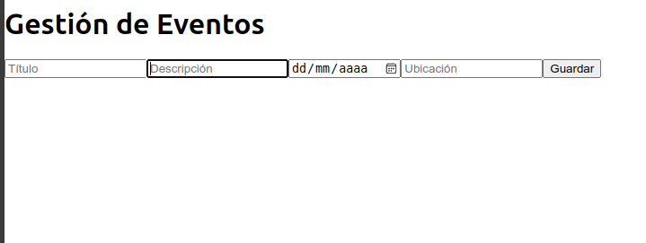

# Ejercicio 3: Sistema de Gestión de Eventos con React y JavaScript

## Descripción del Problema

Desarrolla una aplicación de gestión de eventos utilizando React con JavaScript. La aplicación permite a los usuarios crear, editar y eliminar eventos, así como visualizar una lista de eventos existentes. Se implementan diversas características avanzadas que abarcan conceptos de programación orientada a objetos (OOP), manejo de estado en React y gestión avanzada de promesas.

## Requisitos Implementados

1. **Programación Orientada a Objetos (OOP)**
   - Uso de la clase `Event` para encapsular la estructura de los eventos.

2. **Manejo del Estado con React Hooks**
   - Se gestionan los eventos utilizando `useReducer` y `useContext` para proporcionar un estado global.
   - Se implementan hooks adicionales como `useState`, `useEffect` y `useRef`.

3. **Promesas y Operaciones Asíncronas**
   - Simulación de la gestión de eventos como operaciones asíncronas.

4. **Reutilización de Componentes y Lógica**
   - Los componentes se dividen de manera modular para mejorar la reutilización y la legibilidad.

## Código Fuente

El código fuente se encuentra en el archivo `App.js` dentro de la carpeta `src/`. A continuación se detalla todo el código:

```javascript
// Archivo: src/App.js
import React, { useState, useReducer, useContext, createContext, useCallback, useEffect, useRef } from "react";

// Clase Event para encapsular la estructura de los eventos
class Event {
  constructor(id, title, description, date, location) {
    this.id = id;
    this.title = title;
    this.description = description;
    this.date = date;
    this.location = location;
  }
}

// Estado inicial para el reducer
const initialState = {
  events: [],
  selectedEvent: null,
  error: null,
};

// Acciones del reducer
const eventReducer = (state, action) => {
  switch (action.type) {
    case "ADD_EVENT":
      return { ...state, events: [...state.events, action.payload], error: null };
    case "EDIT_EVENT":
      return {
        ...state,
        events: state.events.map((event) =>
          event.id === action.payload.id ? action.payload : event
        ),
        selectedEvent: null,
        error: null,
      };
    case "DELETE_EVENT":
      return {
        ...state,
        events: state.events.filter((event) => event.id !== action.payload),
        error: null,
      };
    case "SET_SELECTED_EVENT":
      return { ...state, selectedEvent: action.payload };
    case "SET_ERROR":
      return { ...state, error: action.payload };
    default:
      return state;
  }
};

// Creación del contexto global
const EventContext = createContext();

// Proveedor del contexto global
const EventProvider = ({ children }) => {
  const [state, dispatch] = useReducer(eventReducer, initialState);
  return (
    <EventContext.Provider value={{ state, dispatch }}>
      {children}
    </EventContext.Provider>
  );
};

// Formulario de eventos para crear o editar eventos
const EventForm = ({ onSubmit, initialData }) => {
  const [title, setTitle] = useState

(initialData?.title || "");
  const [description, setDescription] = useState(initialData?.description || "");
  const [date, setDate] = useState(initialData?.date || "");
  const [location, setLocation] = useState(initialData?.location || "");
  const inputRef = useRef();

  useEffect(() => {
    if (initialData) inputRef.current.focus();
  }, [initialData]);

  const handleSubmit = (e) => {
    e.preventDefault();
    if (!title || !description || !date || !location) {
      onSubmit(null, "Todos los campos son requeridos.");
      return;
    }
    onSubmit(
      new Event(initialData?.id || Date.now(), title, description, date, location),
      null
    );
  };

  return (
    <form onSubmit={handleSubmit}>
      <input
        ref={inputRef}
        type="text"
        value={title}
        onChange={(e) => setTitle(e.target.value)}
        placeholder="Título"
      />
      <input
        type="text"
        value={description}
        onChange={(e) => setDescription(e.target.value)}
        placeholder="Descripción"
      />
      <input
        type="date"
        value={date}
        onChange={(e) => setDate(e.target.value)}
      />
      <input
        type="text"
        value={location}
        onChange={(e) => setLocation(e.target.value)}
        placeholder="Ubicación"
      />
      <button type="submit">Guardar</button>
    </form>
  );
};

// Lista de eventos con opciones para editar y eliminar
const EventList = () => {
  const { state, dispatch } = useContext(EventContext);

  const handleDelete = (id) => {
    dispatch({ type: "DELETE_EVENT", payload: id });
  };

  const handleEdit = (event) => {
    dispatch({ type: "SET_SELECTED_EVENT", payload: event });
  };

  return (
    <ul>
      {state.events.map((event) => (
        <li key={event.id}>
          <p>{`${event.title} - ${event.date} en ${event.location}`}</p>
          <button onClick={() => handleEdit(event)}>Editar</button>
          <button onClick={() => handleDelete(event.id)}>Eliminar</button>
        </li>
      ))}
      {state.error && <p style={{ color: "red" }}>{state.error}</p>}
    </ul>
  );
};

// Componente de tablero de gestión de eventos
const EventDashboard = () => {
  const { state, dispatch } = useContext(EventContext);

  const handleFormSubmit = (event, error) => {
    if (error) {
      dispatch({ type: "SET_ERROR", payload: error });
      return;
    }
    if (state.selectedEvent) {
      dispatch({ type: "EDIT_EVENT", payload: event });
    } else {
      dispatch({ type: "ADD_EVENT", payload: event });
    }
  };

  return (
    <div>
      <EventForm
        onSubmit={handleFormSubmit}
        initialData={state.selectedEvent}
      />
      <EventList />
    </div>
  );
};

// Componente principal de la aplicación
const App = () => {
  return (
    <EventProvider>
      <h1>Gestión de Eventos</h1>
      <EventDashboard />
    </EventProvider>
  );
};

export default App;
```


### Explicación de la Solución

La aplicación de gestión de eventos fue desarrollada utilizando React y JavaScript, con un enfoque en el uso de conceptos avanzados de React Hooks y programación orientada a objetos (OOP). A continuación, se describe la lógica y arquitectura de la aplicación:

#### 1. **Programación Orientada a Objetos (OOP)**

- **Clase `Event`**: Se define la clase `Event` que encapsula la estructura básica de un evento. Esto proporciona una abstracción clara para la creación y gestión de los eventos dentro de la aplicación.
  
  ```javascript
  class Event {
    constructor(id, title, description, date, location) {
      this.id = id;
      this.title = title;
      this.description = description;
      this.date = date;
      this.location = location;
    }
  }
  ```

#### 2. **Manejo del Estado con React Hooks**

- **Estado Global con `useReducer` y `useContext`**: Se utiliza un reducer (`eventReducer`) junto con `useReducer` para gestionar el estado de la lista de eventos y las acciones que se pueden realizar sobre estos (crear, editar, eliminar, establecer errores, etc.). Luego, se crea un `EventContext` y un componente `EventProvider` para proporcionar el estado global de la aplicación.

- **Formularios y Manejo de Datos**: Los formularios para agregar y editar eventos se gestionan mediante `useState` para manejar los datos de entrada. Se utilizan referencias con `useRef` para enfocar automáticamente el campo de texto cuando se selecciona un evento para editar.

#### 3. **Uso de Hooks Personalizados y Modularidad**

- **Uso de Hooks**: La aplicación hace un uso extensivo de los Hooks básicos de React, como `useState`, `useEffect`, `useReducer`, `useContext` y `useRef`, para gestionar el ciclo de vida de los componentes, el estado y los efectos secundarios.

- **Encapsulación y Reutilización de Componentes**: Cada componente tiene una responsabilidad específica: `EventForm` se encarga de la creación y edición de eventos, mientras que `EventList` se ocupa de mostrar la lista de eventos y permitir su eliminación y edición. El componente `EventDashboard` sirve como un punto central de coordinación.

#### 4. **Manejo de Errores y Validaciones**

- Se implementan verificaciones básicas para validar que todos los campos del formulario de eventos estén completos. En caso contrario, se muestra un mensaje de error y se establece en el estado global mediante la acción `SET_ERROR`.

### Resultado de la Aplicación

- La aplicación permite realizar las siguientes operaciones de manera fluida y en tiempo real:

  - **Crear un Evento**: El usuario puede ingresar los detalles de un nuevo evento utilizando el formulario.
  - **Editar un Evento**: Al hacer clic en "Editar", los campos del formulario se completan automáticamente con los datos del evento seleccionado, permitiendo al usuario hacer los cambios necesarios.
  - **Eliminar un Evento**: El usuario puede eliminar eventos de la lista haciendo clic en el botón "Eliminar".
  - **Visualizar Eventos**: Todos los eventos creados se muestran en una lista con sus detalles (título, fecha y ubicación).

### Descripción del Resultado



Cuando se ejecuta la aplicación, se muestra un **formulario para agregar eventos** y una **lista de eventos**. Al guardar un nuevo evento, este se agrega automáticamente a la lista y se muestra en la pantalla. Si se selecciona un evento para editar, el formulario se completa automáticamente con la información correspondiente y se permite modificar los detalles. El usuario también puede eliminar eventos de la lista, y los cambios se actualizan de inmediato en la interfaz.


### Instrucciones para Crear y Ejecutar la Aplicación

1. **Crear el Proyecto**:

   Ejecuta el siguiente comando para crear un nuevo proyecto de React con JavaScript utilizando Create React App:

   ```bash
   npx create-react-app ejercicio3 --template javascript
   ```

   Este comando creará un directorio llamado `ejercicio3` con la estructura de un proyecto de React.

2. **Navegar al Directorio del Proyecto**:

   ```bash
   cd ejercicio3
   ```

3. **Agregar el Código Fuente**:

   Reemplaza el contenido del archivo `src/App.js` con el código proporcionado.

4. **Instalar las Dependencias**:

   ```bash
   npm install
   ```

5. **Ejecutar la Aplicación**:

   ```bash
   npm start
   ```

6. **Acceder a la Aplicación**:

   La aplicación se ejecutará en el navegador en `http://localhost:3000`.
